# Architecture

This document describes the current conceptual architecture of Skynvættr.

Skynvættr is a runtime for persistent artificial entities. Each running Skynvættr instance represents such an entity: a continuously existing artificial system that perceives an environment, maintains evolving internal context over time, processes and reasons about what it senses, and can eventually affect that environment through explicitly defined mechanisms.

The architecture is intentionally domain-independent. Home automation, infrastructure monitoring, robotics, software systems, simulations, and other environments should be integrations built around the same core model rather than assumptions embedded into the runtime.

The first implementation is expected to evolve significantly. The concepts in this document are therefore intended to establish boundaries and vocabulary before the Kotlin API is allowed to solidify around implementation details.

## Architectural principles

The architecture is guided by a few core principles:

1. **Persistence over request/response**  
   A running Skynvættr instance exists across processing and perception cycles. It is not instantiated merely to answer one request and disappear.

2. **Signals are not perceptions**  
   Raw environmental data must remain distinct from the interpretation of that data.

3. **Internal representation is intentionally open**  
   Perception may contribute to persistent internal state or context, but Skynvættr does not yet prescribe whether that state should be represented as explicit beliefs, learned latent state, memories, structured facts, or some combination.

4. **Reasoning is a component, not the system**  
   An LLM, neural network, classifier, rules engine, or other model may participate in reasoning without defining the architecture as a whole.

5. **Sensing and acting are explicit boundaries**  
   The environment enters through signals and is affected through effectors. Integrations should not bypass these boundaries.

6. **Time is first-class**  
   History, rate of change, duration, ordering, freshness, and temporal relationships may all affect interpretation.

7. **Attention is selective**  
   Most environmental changes should not require expensive reasoning. Policies and lower-cost processing should determine what deserves further attention.

8. **Uncertainty is expected**  
   Different sources may disagree and observations may be incomplete. The architecture should leave room for uncertainty without prescribing how it must be represented.

9. **Subsystem cadence should be stable**  
   Individual sensing, perception, maintenance, and reasoning subsystems may each operate on their own cadence. These intervals should generally be explicit and stable rather than continuously adjusted as a proxy for attention.

10. **External constraints should remain external**  
    External services may impose their own operational constraints. These should be handled at the integration or resource boundary without coupling the cadence of internal subsystems directly to a particular provider.

## The continuous loop

At the highest level, a running Skynvættr instance participates in a continuous feedback loop with its environment.

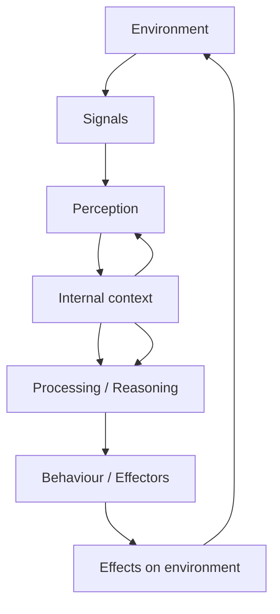

This diagram is intentionally circular. The system does not process one isolated input to produce one isolated output. Each cycle takes place in the context produced by previous cycles.

## Core interaction loop

The current architecture deliberately keeps the cognitive path broad.

```text
Environment -> Sensing -> Processing / internal state -> Behaviour -> Environment
```

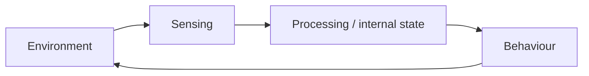

This is intentionally less specific than a pipeline of named cognitive objects. Skynvættr should establish the boundaries required for persistent sensing, processing, learning, and interaction without prematurely deciding how goals, expectations, plans, decisions, or intentions must be represented internally.

### Signal

A **Signal** is a value, state, or event received from the environment through a defined channel.

Examples:

- a temperature reading;
- a detected position;
- a process becoming unavailable;
- a camera classifier detecting an object;
- an API returning a state;
- an incoming event from a message bus.

A signal represents what a particular source reported, not necessarily objective truth.

A signal may carry metadata such as:

- timestamp;
- source;
- confidence;
- reliability;
- unit;
- quality;
- sequence or correlation information.

### Observation

An **Observation** is the result of perception: an interpretation that is meaningful to the entity.

A raw signal such as:

```text
temperature = 29.1 C
```

might contribute to an observation such as:

```text
The temperature has risen unusually quickly during the last 20 minutes.
```

Observations may be derived from one signal, many signals, historical state, existing beliefs, or combinations of these.

### Internal state / context

Perception may update persistent internal state used by later processing and decisions.

The runtime should not yet prescribe the form of that state. Candidate approaches may include:

- structured facts or relationships;
- explicit hypotheses or beliefs with confidence;
- episodic or semantic memory;
- learned latent state;
- model-specific context;
- combinations of several approaches.

These alternatives should be explored experimentally before one is promoted to a core abstraction.


### Behaviour and action

Skynvættr is intended to eventually affect its environment, but the architecture does not yet prescribe a specific cognitive object such as an `Intent`.

A long-term goal is for Skynvættr to be able to communicate or otherwise represent what it is trying to achieve well enough that behaviour can be selected, outcomes can be observed, expectations can be evaluated, and future behaviour can adapt or learn from the result.

Whether concepts such as intent, goal, plan, expectation, or action become explicit core abstractions should be determined through experiments rather than fixed now.

## Signals, entities, channels, and sources

The signal model should provide semantic structure rather than treating environmental state as a flat collection of keys.

A tentative model is:

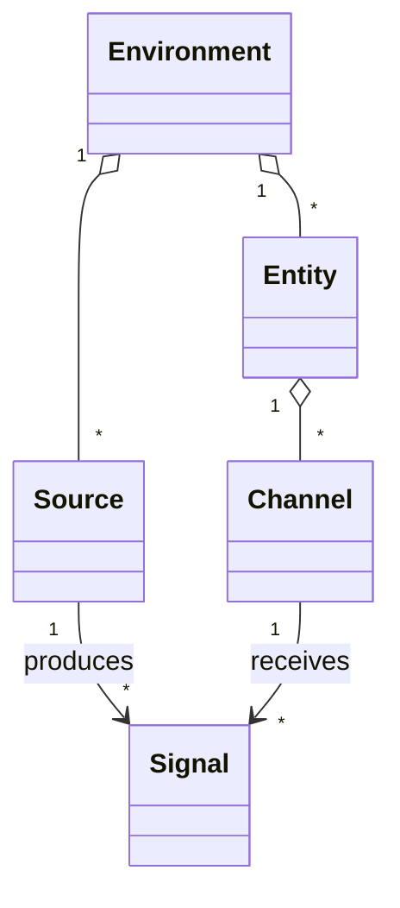

### Source

A **Source** is something capable of producing signals.

Examples include:

- a physical sensor;
- a Home Assistant integration;
- a camera perception model;
- an operating-system telemetry collector;
- an API;
- an event stream;
- another external system.

### Entity

An **Entity** is something in the observed world about which the system can maintain state or beliefs.

Examples include a person, animal, room, machine, application, service, vehicle, or other meaningful object.

### Channel

A **Channel** is a semantic signal stream associated with an entity or source.

Examples:

- temperature;
- presence;
- position;
- connectivity;
- state;
- velocity;
- load;
- availability.

Channels should define meaning and expected shape without embedding assumptions about where their values originate.

### Signal history and current state

The runtime should retain both current values and historical signals where appropriate.

Historical information enables interpretation of:

- rate of change;
- duration;
- repeated patterns;
- freshness;
- transitions;
- correlations;
- temporal sequences.

A current value alone is often insufficient for useful perception.

## Perception

The perception layer turns raw signals and context into observations.

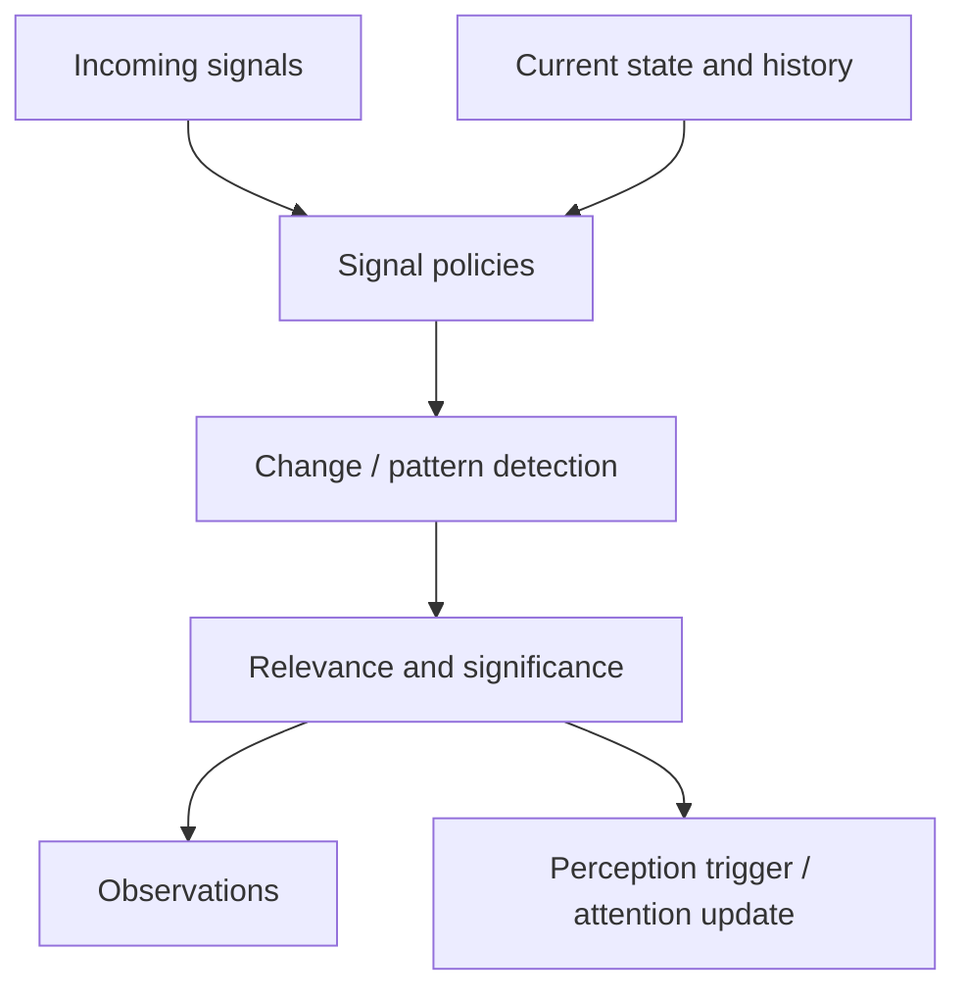

Perception is not required to involve an LLM. Lower-cost deterministic or learned components should handle routine processing whenever possible.

### Signal policies

Signal policies are the first line of interpretation and filtering.

A policy may decide to:

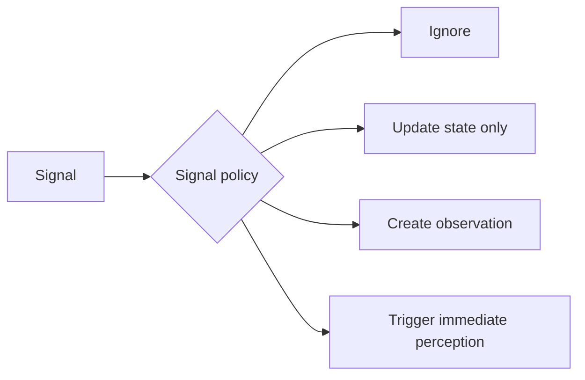

Policies may consider:

- absolute thresholds;
- rate of change;
- elapsed time;
- source reliability;
- signal confidence;
- disagreement between sources;
- current context;
- combinations of channels;
- expected versus actual state.

This allows most uninteresting changes to be processed without invoking higher-cost reasoning.

## Scheduling, cadence, and resource budgets

Skynvættr should not depend on one global perception interval.

Different subsystems may have different natural cadences. A temperature source might be sampled periodically, a local classifier may run frequently, a maintenance process may run much less often, and an event-driven source may have no polling interval at all.

Where an interval is appropriate, the default model is that it belongs to the individual subsystem and remains as stable as practical.

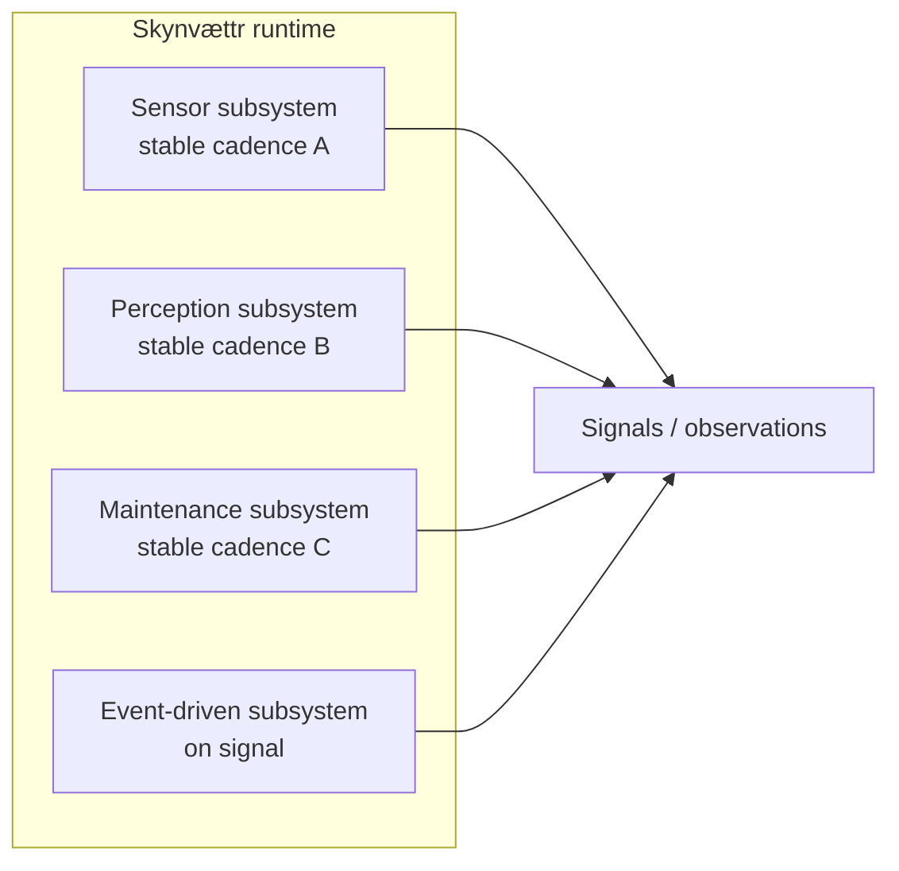

This differs from earlier prototype approaches where a comparatively global perception interval could be adjusted to make the system "wake up" more or less frequently. Skynvættr should instead let each subsystem express its own timing requirements.

Attention still matters, but it should primarily affect **priority and allocation of processing resources**, not continuously rewrite subsystem intervals.

For example, attention may influence:

- which pending observations are processed first;
- which histories or contextual data are loaded;
- which reasoning component is selected;
- how much inference budget is allocated;
- whether an unresolved question deserves an external model call;
- which tasks may consume a constrained external resource.

### External service constraints

External services may impose limits or temporary availability constraints of their own. Skynvættr should treat these as properties of the integration boundary rather than as timing rules for the entity itself.

A subsystem should therefore be able to retain its own cadence even when an external dependency cannot immediately satisfy a request. The exact mechanisms for handling such constraints are intentionally left to later design.


## Persistent internal context

A running Skynvættr instance needs some form of persistent internal context across processing cycles. This allows later perception and decisions to depend on what has happened before rather than only on the latest signal.

The architecture intentionally does not yet define this as a particular "world model" structure.

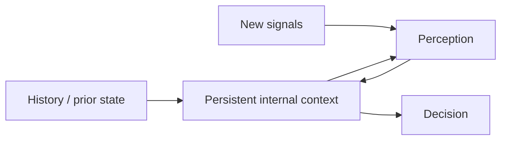

Possible representations include structured state, memory, explicit beliefs, learned latent representations, or mixtures of these. Which abstractions deserve to become part of the core API should be determined through experiments and measured behavior rather than assumed up front.

## Internal state and drives

A running Skynvættr instance may need internal state that is neither a representation of the environment nor an externally supplied goal.

Examples might include:

- uncertainty;
- urgency;
- curiosity;
- attention;
- confidence;
- unresolved questions;
- goals;
- impulses or other internal drives.

These concepts should not require anthropomorphic interpretation. They may simply be structured values that influence prioritization and reasoning.

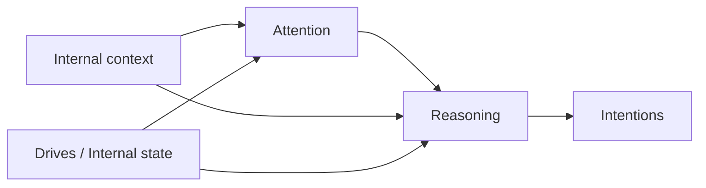

For example, high uncertainty about an important belief may cause the system to increase attention toward signals capable of resolving that uncertainty.

## Reasoning and minds

Reasoning is a subsystem within a running Skynvættr instance, not the whole entity itself.

A Skynvættr instance may use multiple reasoning components.

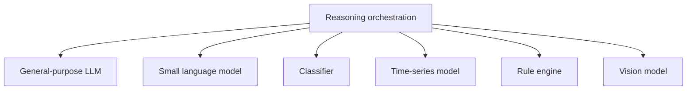

The runtime should therefore avoid assuming that reasoning means making one call to one LLM provider.

Different components may specialize in:

- interpreting observations;
- anomaly detection;
- temporal prediction;
- visual perception;
- planning;
- language interaction;
- safety validation;
- domain-specific inference.

A higher-level "mind" abstraction may eventually coordinate these components, but that terminology remains provisional.

## Intentions, capabilities, and effectors

The action side should be as explicit and general as the sensing side.

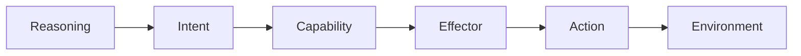

### Capability

A **Capability** describes something a Skynvættr instance is allowed and able to do in semantic terms.

Examples:

- change room temperature;
- send a message;
- move a robotic actuator;
- restart a software service;
- request additional information.

Capabilities provide a boundary where availability, policy, permissions, and safety constraints can be expressed.

### Effector

An **Effector** is an environment-specific mechanism capable of carrying out actions.

Examples might include:

- Home Assistant;
- MQTT;
- Kubernetes;
- a robot controller;
- a shell or operating-system integration;
- an external API.

The world model and reasoning layers should not need to know the implementation details of these integrations.

### Example

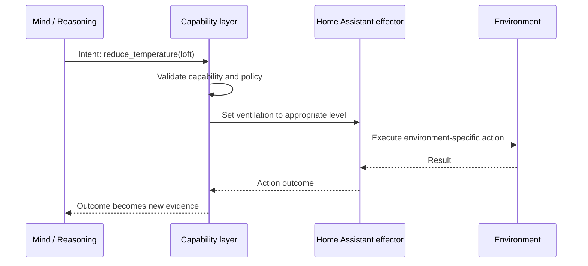

Action outcomes should return to the perception/world-model loop as evidence. An action being requested does not imply that it succeeded.

## Integration boundary

Skynvættr should not embed assumptions about a particular environment.

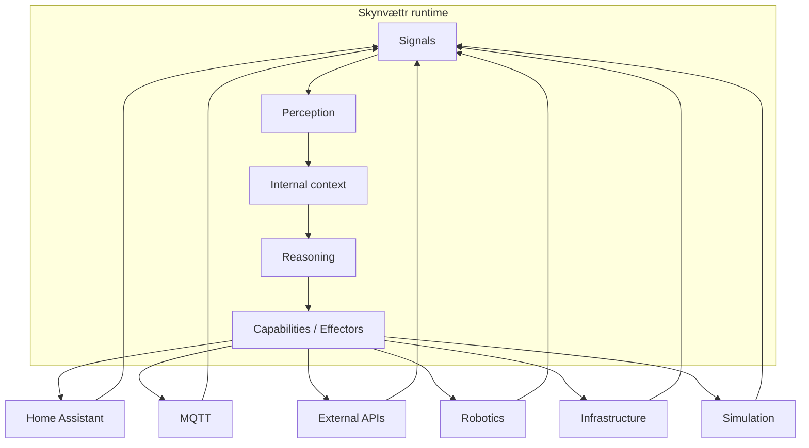

Home Assistant may be an important early integration because it provides a rich environment for experimentation, but it must remain an adapter around the core model.

## Lessons from earlier experiments

Several architectural ideas were explored in earlier experiments and prototypes and motivate the current Skynvættr model.

These include:

- structured signal policies;
- weighting and filtering observations using dimensions such as importance, reliability, significance, and confidence;
- persistent historical and contextual state;
- adaptive perception intervals as an experimental mechanism, with the lesson that Skynvættr should instead give individual subsystems their own mostly stable cadences while keeping external service constraints separate from those internal rhythms;
- stored thoughts and unresolved questions;
- internal impulses and mood-like state;
- multiple specialized reasoning components or "subminds";
- explicit tools for affecting the environment.

Skynvættr should preserve the useful concepts discovered through those experiments while removing assumptions that belonged specifically to the prototype implementations, orchestration tools, environment integrations, or any particular model provider.

## Tentative runtime decomposition

The implementation should remain free to evolve, but the conceptual boundaries suggest a decomposition similar to:

```text
skyn-vaettr
|
+-- core
|   +-- entities
|   +-- signals
|   +-- channels
|   +-- observations
|   +-- time
|
+-- perception
|   +-- policies
|   +-- change-detection
|   +-- attention
|   +-- pipeline
|
+-- world
|   +-- state
|   +-- history
|   +-- memory
|
+-- mind
|   +-- reasoning
|   +-- models
|   +-- orchestration
|   +-- drives
|
+-- actions
|   +-- capabilities
|   +-- effectors
|
+-- integrations
    +-- ...
```

This is not a prescribed package structure. Creating empty modules merely to mirror this diagram would be premature. The value of the decomposition is to keep responsibilities separate as concrete types emerge.

## Early implementation focus

The initial milestones should concentrate on the parts that establish the semantic foundation:

1. entities, channels, and signals;
2. current and historical signal state;
3. signal policies;
4. observation generation;
5. a perception pipeline;
6. a minimal persistent internal context representation.

Reasoning orchestration, richer belief revision, internal drives, and effectors can be introduced once those foundations have proven useful.

This sequence deliberately avoids starting with an LLM abstraction. Doing so would risk making the reasoning implementation define the architecture instead of fitting into it.

## Open architectural questions

Several concepts remain intentionally unresolved:

- What is the exact ownership relationship between sources, entities, and channels?
- Should observations be immutable event records?
- Which internal-state representations prove useful enough to become core abstractions?
- Which parts of internal context should be durable across restarts?
- How should temporal relationships be represented?
- Is attention a first-class object, a policy result, or both?
- Should "mind" become a concrete abstraction or remain descriptive terminology?
- How should reasoning components declare the context they require?
- How should capabilities express permissions, risk, and reversibility?
- How should a Skynvættr instance distinguish externally assigned goals from internally generated drives?
- How should multiple Skynvættr instances communicate or share information, if that becomes useful?

These questions should be answered through implementation and experiments rather than prematurely fixed in the public API.

## Summary

The central architectural idea is that a running Skynvættr instance is the complete persistent loop:

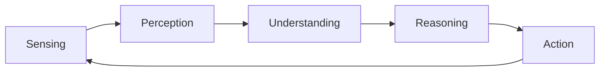

An LLM is not Skynvættr. Home Assistant is not Skynvættr. A memory store is not Skynvættr.

They may all participate in a Skynvættr instance.

The Skynvættr runtime brings sensing, perception, persistent internal state, reasoning, and action together so that each running instance forms one continuously existing artificial entity while keeping those concerns separable and composable.
