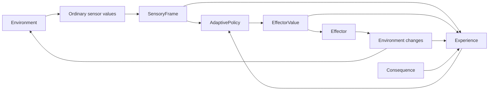
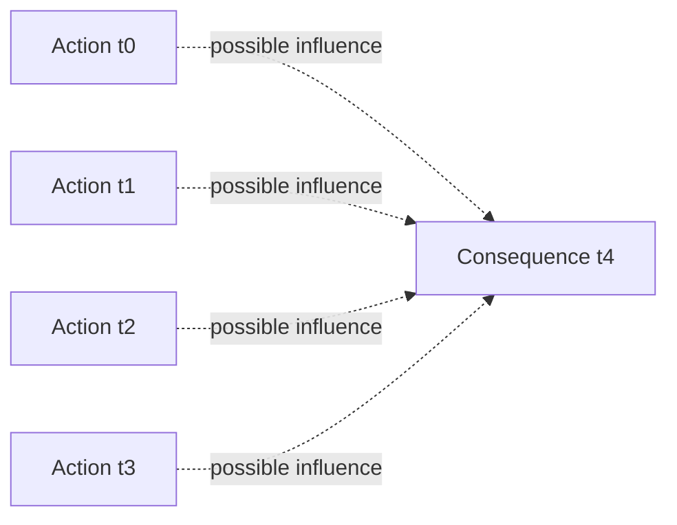
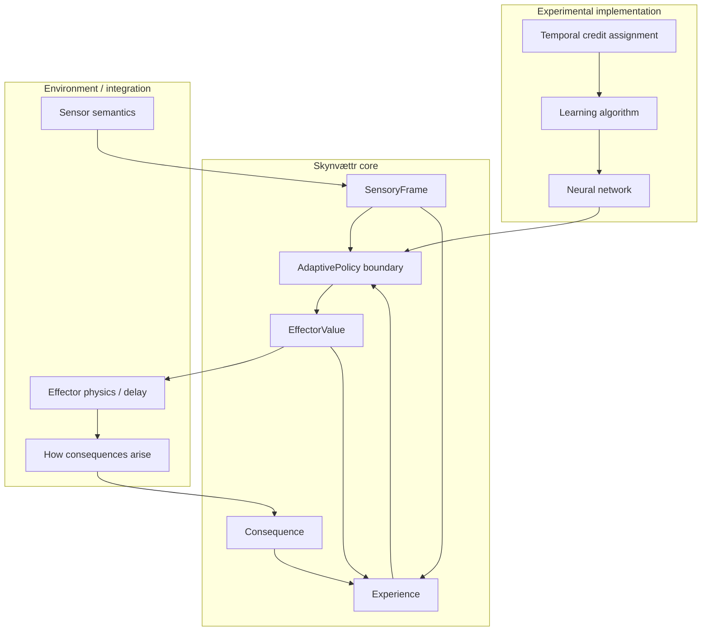

# Consequence-driven learning flow

This document describes the minimal learning boundary introduced by the consequence-learning experiment.

Skynvættr core does **not** define what a sensor means, what an effector does, or which environmental state is desirable. It only provides a neutral structure for observations, actions, outcomes, and learning feedback.

## Core interaction

The important distinction is that `Consequence` does not describe a correct action. It is only global feedback about whether an experienced outcome should be reinforced or discouraged.

## Time and delayed consequences

A consequence observed now may have been caused by actions from several earlier cycles.

Core deliberately does not prescribe how temporal credit assignment works. A learner may use eligibility traces, recurrent state, a learned world model, replay, or another approach.

## Architectural boundary

This keeps domain-specific meaning outside the core while still giving experiments a common feedback boundary.
