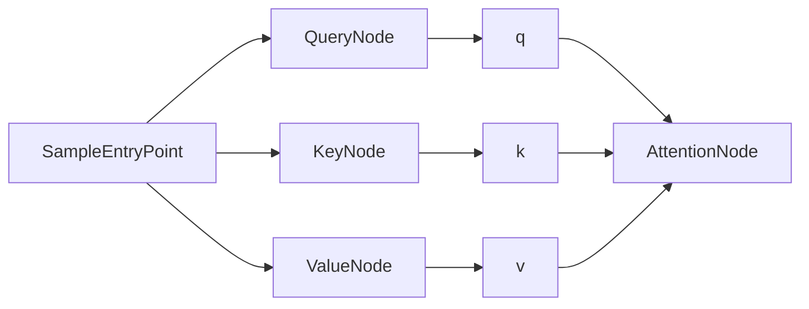

# Default topology

`DefaultTopology` is the initial concrete implementation of the [topology contract](topology.md).
It provides a small synchronous network for experiments while keeping `Topology` independent of any
particular processing model.

## Construction and update

`Vaettr` owns an `Environment` and a `Topology`. When no topology is supplied, it creates a
`DefaultTopology` for that environment. `Vaettr.update()` delegates directly to `Topology.update()`.

`DefaultTopology` receives a list of `Node` instances and copies it into its read-only `nodes` list.
Its `entryPoints` list is derived from those nodes by selecting the `EntryPoint<*>` instances. Other
nodes remain part of the topology even though they are not polled directly by the environment.

The `TopologyBuilder` form is intended for system-level composition:

```kotlin
val topology = DefaultTopology(environment) {
    val signalIngress = add(SignalIngress())
    val memory = add(MemorySystem())
    val executive = add(ExecutiveFunctions())

    signalIngress.attentionPort.connectTo(memory.inputPort, executive.inputPort)
    memory.outputPort.connectTo(executive.memoryInputPort)
    executive.memoryQueryPort.connectTo(memory.queryPort)
}
```

The builder overloads `add` for both standalone nodes and named `Group` instances.

`Group` is the boundary for a named system. A concrete group owns its internal nodes and may
expose selected ports as properties. Those properties refer to the actual internal ports, so a
connection made through the group is still a normal `Synapse` between the underlying nodes.

For groups assembled by the reusable builder, exposed ports are addressed by name:

```kotlin
val memory = Group.build("Memory system") {
    val encoder = add(MemoryEncoder())
    val store = add(MemoryStore())

    expose("input", encoder.input)
    encoder.output.connectTo(store.input)
    expose("output", store.output)
}

signalIngress.output.connectTo(memory["input"])
memory["output"].connectTo(executive.memoryInput)
```

Kotlin cannot create arbitrary dot-properties such as `memory.input` at runtime. A concrete group
type can still provide typed properties that delegate to `port("input")` when that syntax is useful.

On each update, `DefaultTopology`:

1. collects the distinct input types declared by its entrypoints;
2. calls `Environment.getNew(type)` once for each distinct type;
3. passes each non-empty batch to every entrypoint declaring that type.

This means two entrypoints with the same input type receive the same batch. Empty batches do not call
`EntryPoint.process`. Processing and port delivery are synchronous in this implementation.

## Current example network

The example reports build the following topology using identity Q/K/V projections:



`SampleEntryPoint` stores incoming samples in its `MutableSampleStore`, selects the configured
history ages for each signal, and emits one `Representation` containing signal identity, scalar
value, and normalized relative time for each selected observation.

`QueryNode`, `KeyNode`, and `ValueNode` each have an input and output port. Their default
`IdentityRepresentationProjection` keeps the sample representation unchanged. A separate
`LinearRepresentationProjection` can be supplied to each node with its own weights and bias. The
projection is applied independently to every position in the input representation.

`AttentionNode` waits until its `q`, `k`, and `v` ports each contain a representation. It invokes its
configured `Attention` implementation, clears those three inputs after successful computation and
before output delivery, and emits `AttentionResult.output` through its `attention` port. If attention
computation fails, the inputs remain available. A failure while delivering the output happens after
the inputs have been cleared.

## Port and delivery behaviour

The generic `Port<T>` contract exposes its name, receive event, outgoing `synapses`, and send/receive
operations. The current `SingleSlotPort<T>` implementation retains zero or one value, rejects a new
value while occupied, and exposes `pending` and `clear()` to nodes that use that buffering policy.

Connections are created by calling `source.connectTo(target1, target2)` before the topology is
constructed. The method is a command; outgoing connections can be inspected through
`source.synapses`. One source port may fan out to several target ports. `DefaultTopology` does not yet validate that
every connected target belongs to its `nodes` list, nor does it own a separate connection registry.

## Report rendering

The reporting source set uses `TopologyRenderer` to inspect `Topology.nodes`, each node's `ports`, and
each port's `synapses`. It writes `topology.dot` and invokes Graphviz to produce `topology.png`.
Ports are not drawn as separate nodes; each directed arrow connects the nodes that own the source and
target ports. `Topology.groups` become Graphviz clusters with the group name as their label. Multiple
connections between the same pair of nodes are rendered as one arrow, while disconnected nodes remain
visible.

Install Graphviz and make `dot` available on `PATH`, or set `GRAPHVIZ_DOT` to the executable path.
The example reports can then be rendered with `./gradlew renderExampleReports` or
`gradlew.bat renderExampleReports` on Windows. CI installs Graphviz and publishes the topology image
alongside the example charts.

`TopologyRenderer` uses `TopologyGraphStyle` for Graphviz styling. The default style uses a light
filled node theme, rounded group clusters, orthogonal connections, and a transparent background. A
report can provide another style when it creates the renderer:

```kotlin
val style = TopologyGraphStyle(
    graphAttributes = mapOf("rankdir" to "TB", "bgcolor" to "white"),
    nodeAttributes = mapOf(
        "shape" to "ellipse",
        "style" to "filled",
        "fillcolor" to "#FFF4CC",
    ),
    edgeAttributes = mapOf("color" to "#8A6D1D", "penwidth" to "1.5"),
    groupAttributes = mapOf(
        "style" to "rounded,filled",
        "color" to "#D6B656",
        "fillcolor" to "#FFFBEA",
    ),
)

TopologyRenderer(style = style).render(topology, reportDir)
```

## Deliberate limits

`DefaultTopology` currently provides synchronous delivery, single-slot buffering, and direct
entrypoint polling. It does not define asynchronous scheduling, retries, queue policies, multi-input
correlation, topology-level validation, or training/update rules for projection parameters. Those
remain experiments and design questions for future topology implementations.
