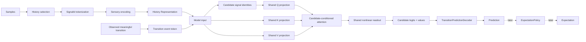
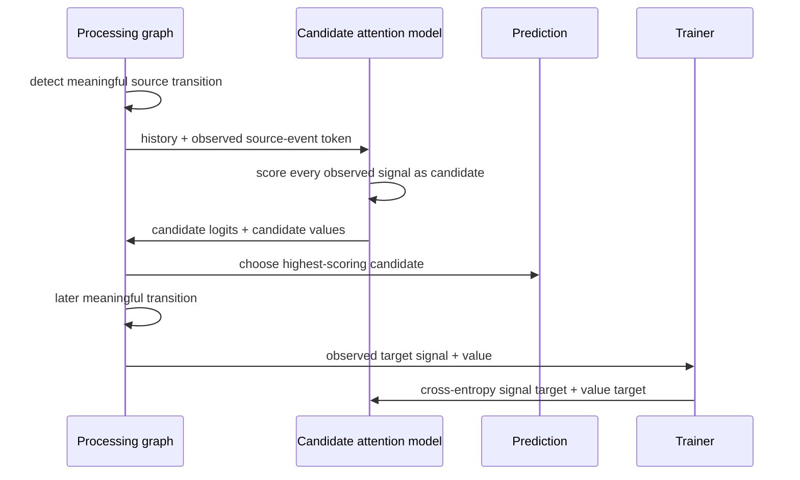
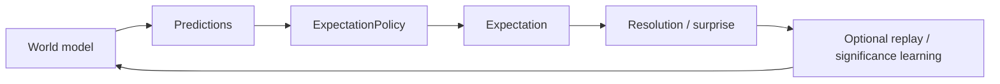

# Predictions and Expectations

This document defines the current prediction/expectation boundary in Skynvættr core and the active learning experiment.

## Current experiment: learn predictions before expectations

The thermal and kitchen examples currently stop at `Prediction`. They intentionally do **not** create `Expectation` instances while we validate whether a learned attention model can discover useful temporal relationships and predict the next meaningful transition.

Expectation types, policies, results and replay infrastructure remain in core for later use; they are not removed by this experiment.

`SensoryRepresentationEncoder` owns history selection and sensory encoding. `TransitionPredictionProcessingGraph` owns transition detection, model inference and decoding. `TransitionPredictionTrainer` only supervises already-completed graph executions.

## Representation and observed events

Ordinary sensory positions are encoded as:

`[signal identity embedding..., scalar value, relative time, event flag=0]`

When a meaningful numeric transition triggers inference, the graph also appends an observed event token:

`[signal identity embedding..., delta, relative time, event flag=1]`

The event token tells the model **what just changed**. It contains no target-signal identity and therefore does not encode the answer to what should happen next.

`Representation` itself remains a generic sequence of embeddings. Symbolic `SensoryPosition` metadata is kept alongside it only for diagnostics and report labels.

## Horizon-free next-transition prediction

`Prediction<T>` deliberately has no mandatory target timestamp or configured `+N` horizon.

After a meaningful transition, the graph predicts the next meaningful numeric transition. When that later transition is observed, its signal identity and value supervise the earlier graph execution.

The trainer owns neither the model, decoder nor transition detector. It trains the exact graph-owned model/input pair that produced the pending prediction.

## Candidate-conditioned attention

Each distinct signal identity present in the model input becomes one candidate query. All candidates share the same Q/K/V projections. K/V are computed from the complete sensory/event history. A shared nonlinear feed-forward readout over `[candidate query ; attended context]` produces one logit and one value for each candidate.

Target signal identity is trained with cross-entropy over candidate logits. Numeric value loss is applied only to the candidate that actually transitions next.

This replaced an earlier failed approach that regressed directly toward a signal-identity embedding with MSE; that objective could converge between signal identities and make nearest-neighbour decoding consistently choose one side.

## Inspectability

The examples report days 1, 3, 5 and 10.

1. **Candidate-attention heatmap** — rows are candidate/query signals and columns are attended-to history signals. For example, `state.kitchen.light → state.kitchen.dimmer` shows how much dimmer history the light candidate uses while being scored.
2. **Target-signal matrix** — normalized actual-vs-predicted next-transition identity.
3. **Prediction metrics** — target-signal accuracy and value MAE.

Attention is diagnostic evidence, not causal proof.

## Current result

The current candidate-attention implementation is mechanically working and CI is green, but the kitchen experiment still remains near a trivial **50% next-signal baseline** after ten days. The attention matrix also remains approximately 50/50 between dimmer and light rather than learning a useful cross-signal relationship.

That is an experimental failure, not a reporting success. It suggests that the current per-observation attention/readout does not yet provide a strong enough inductive structure for learning the desired target↔source relation from this supervision alone.

A likely next experiment is to move the attention boundary closer to **signal-level or event-level tokens** rather than asking one shallow attention layer to recover signal relationships from many individual historical sample positions.

## Expectations remain a separate layer

`Expectation<T>`, `ExpectationResult`, `ExpectationPolicy<T>`, `NumericExpectationPolicy`, `ExpectationTrainer` and replay infrastructure remain available in core.

They represent a separate concern: deciding when a model-produced prediction is important and reliable enough to retain as a persistent belief.

We are intentionally postponing that layer until the prediction/QKV path is sufficiently understood.
