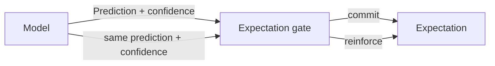

# Predictions and Expectations

This document defines the minimal prediction/expectation boundary currently promoted into Skynvættr core.

## Prediction

`Prediction<T>` is a model-produced value for one `Signal<T>` together with the model's current confidence in that prediction.

Confidence is normalized to `0.0..1.0`. It describes the model's own support for the prediction; it does **not** mean that the runtime has committed to believing it.

Predictions deliberately have no creation time, mandatory target timestamp, or fixed forecast horizon. Timing, ordering and other temporal semantics belong to the model/runtime context around a prediction rather than to the value type itself.

## Expectation gate

A prediction may be considered by an expectation gate. The gate owns policy such as:

- how much model confidence is needed before committing;
- whether a new prediction should create an expectation;
- whether another prediction should reinforce an existing expectation;
- whether that prediction is sufficiently recent or otherwise eligible for reinforcement;
- how much it should cost to hold the expectation;
- how much reward fulfillment should represent.

These rules are deliberately not encoded in `Prediction` or `Expectation`.

## Expectation

`Expectation<T>` is a persistent commitment to a prediction after the expectation gate has decided it is worth believing.

It records:

- the current supporting `Prediction`;
- when the expectation was first formed;
- `cost`, representing how expensive the commitment is;
- `reward`, representing the value of fulfillment;
- `confidence`, initialized from the prediction confidence.

If the model repeats the same signal/value prediction with greater confidence and the gate chooses to reinforce the expectation, the expectation confidence may increase. Core provides `reinforcedBy(...)` only to preserve those invariants; deciding whether reinforcement should occur remains gate policy.

## Current boundary

The intended flow is therefore:

This PR intentionally stops here. Violation detection, surprise, experience records, fulfillment evaluation, reward delivery, lifecycle/expiry and replay policy should be introduced only when experiments establish useful semantics for them.
