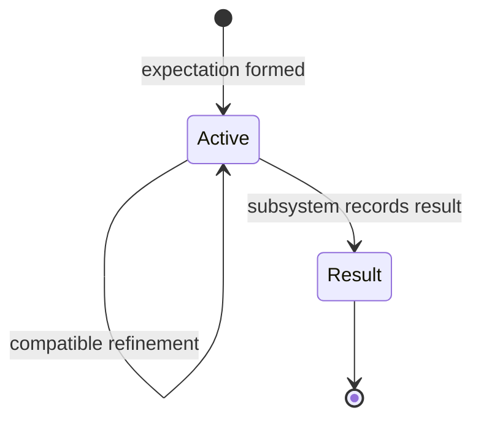
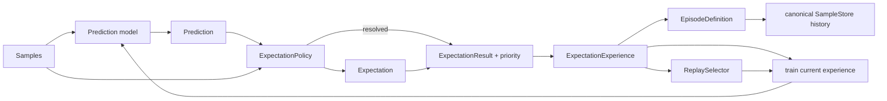
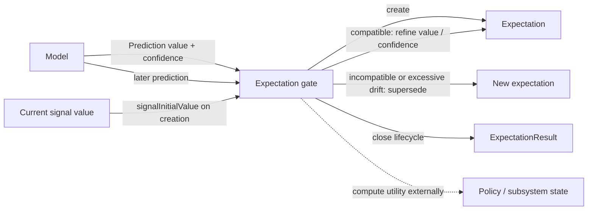
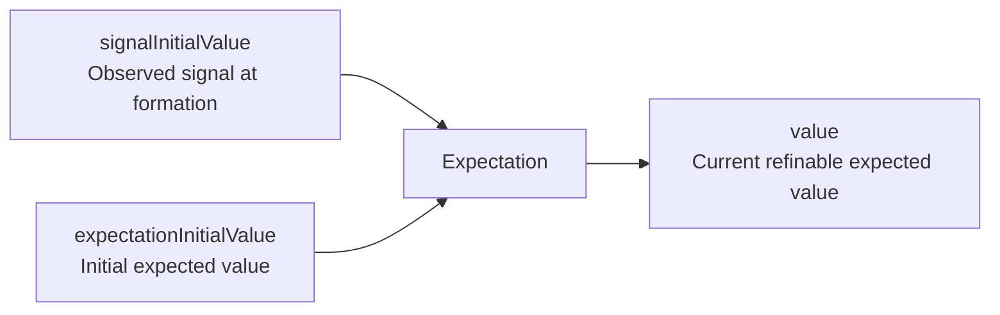

# Predictions and Expectations

This document defines the minimal prediction/expectation boundary currently promoted into Skynvættr core.

## Prediction

`Prediction<T>` is a model-produced value for one `Signal<T>` together with the model's current confidence in that prediction.

Confidence is normalized to `0.0..1.0`. It describes the model's own support for the prediction; it does **not** mean that the runtime has committed to believing it, and it is not necessarily a calibrated probability of correctness.

Predictions deliberately have no creation time, mandatory target timestamp, or fixed forecast horizon. Timing, ordering and other temporal semantics belong to the model/runtime context around a prediction rather than to the value type itself.

## Expectation gate

A prediction may be considered by an expectation gate. The gate owns policy such as:

- how much model confidence is needed before committing;
- whether a new prediction should create an expectation;
- whether a later prediction is compatible with an existing expectation;
- whether a compatible prediction should refine the expected value, reinforce confidence, or both;
- whether an incompatible prediction should supersede the existing expectation;
- whether a prediction is sufficiently recent or otherwise eligible;
- what utility, cost or reward should be associated with creating, maintaining, fulfilling or violating an expectation;
- when an expectation stops being active and which result value should describe that outcome.

Compatibility is intentionally policy-level rather than simple value equality. For example, a temperature prediction moving from `21.0` to `21.2` may refine the same expectation, while a binary state changing from `true` to `false` may represent an incompatible belief.

The gate may also compare the current refined value with `expectationInitialValue`. If the belief has drifted too far from what was initially expected, policy may choose to supersede it rather than continually move the target. How much drift is acceptable, and any additional cost associated with superseding, remain policy decisions.

These rules are deliberately not encoded in `Prediction` or `Expectation`.

## Expectation

`Expectation<T>` represents a persistent belief after the expectation gate has decided a model prediction is worth committing to.

Unlike a `Prediction`, it is not a frozen snapshot of one model output. It records the belief state and stable reference points needed by core:

- the `Signal<T>` the belief concerns;
- `signalInitialValue`, the observed value of that same signal when the expectation was formed;
- `expectationInitialValue`, the initially expected value, equal to `value` when the expectation is created;
- `value`, the currently expected value;
- when the expectation was first formed;
- the current expectation confidence;
- an optional `ExpectationResult` once the expectation is no longer active.

Compatible later predictions may cause the gate to refine `value` and confidence while preserving `signalInitialValue`, `expectationInitialValue` and the original `formedAt`. This preserves both where reality started and what the belief originally committed to, which can later support visualization and policy-level evaluation without allowing gradual refinement to erase the original prediction.

`ExpectationResult` contains an open-ended string `value` and the `timestamp` when the expectation stopped being active. Core deliberately does not define a fixed result vocabulary. A subsystem may use values such as `Fulfilled`, `Abandoned`, `Superseded` or something domain-specific without changing the core type.

The lifecycle is therefore:

A null `result` means the expectation is still active. A non-null result closes its active interval at `result.timestamp`.

Core deliberately does not provide a built-in `reinforcedBy(...)` operation because deciding compatibility and update semantics is gate/policy behavior.

Cost, reward and other utility calculations are intentionally external. They depend on the subsystem, environment or policy evaluating the expectation rather than being intrinsic properties of the belief itself.

## Generic lifecycle policy

`ExpectationPolicy<T>` is the replaceable boundary used by the default learning loop. It decides:

- how a model `Prediction<T>` becomes an `Expectation<T>`;
- whether a later observation resolves the expectation;
- which open-ended `ExpectationResult` describes that resolution;
- which non-negative priority should be attached to the resolved experience.

The priority is deliberately not stored in `Expectation` itself. Different policies may interpret it as surprise, cost, utility, prediction miss or another replay signal.

`NumericExpectationPolicy` is only a small default for continuous numeric signals. Low-confidence or immaterial predictions become stability expectations; material predictions become directional expectations. It can resolve expectations as `Fulfilled` or `Violated` from observed progress. These strings and thresholds are defaults, not core semantics.

## Expectation-driven training

`ExpectationTrainer<I, T>` provides a working generic training loop without adding a forecast horizon:

The trainer captures the model input when an expectation is formed. When policy later resolves that expectation, the value observed at the actual resolution point becomes the training target. The elapsed time may therefore differ from one experience to another; no `+1 minute`, `+5 minute`, or other fixed target horizon is implied.

The resolved expectation also defines an episode spanning its lifetime (optionally with preceding context). Canonical samples remain in `SampleStore`; the episode only identifies which history belongs to that experience.

`WeightedPriorityReplaySelector` is the current generic replay baseline. It samples old experiences proportionally to caller-provided priority with a small floor so low-priority experience is not made unreachable. The lifecycle policy, priority definition and replay selector are all replaceable.

`OnlineKnnPredictionModel` is a dependency-free numeric-vector default that stores resolved training examples and predicts from nearby examples. It exists so the default runtime can actually learn end to end; it is not intended to establish k-nearest-neighbour learning as the preferred Skynvættr model architecture.

## Current boundary

The intended flow is:

The stable reference points are:

The runtime now contains enough generic policy/model/trainer boundaries to exercise this loop end to end. More sophisticated violation detection, surprise models, expectation refinement, utility/reward delivery, model discovery and replay policies should still be promoted only when experiments establish useful semantics for them.
