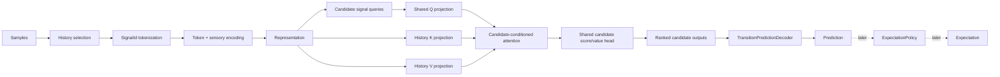
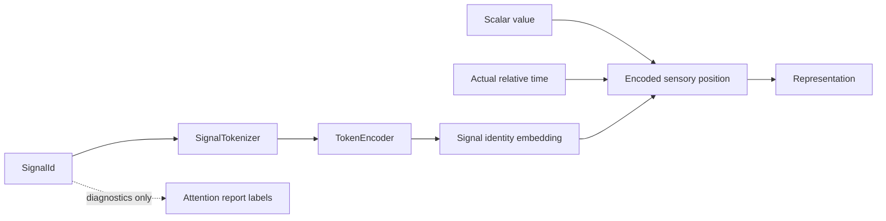
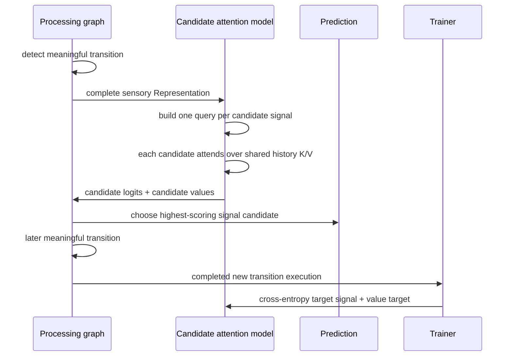
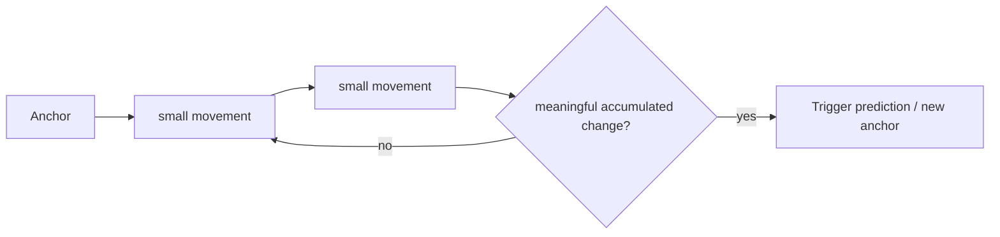
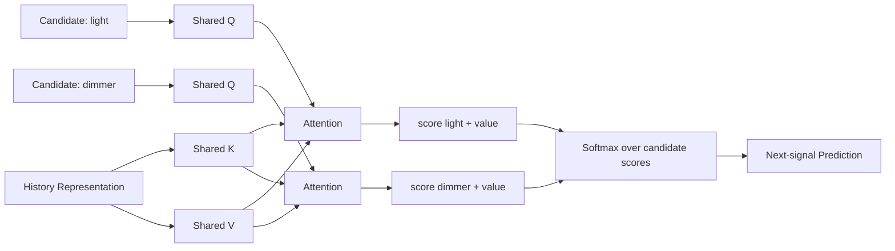
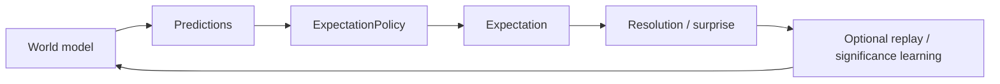

# Predictions and Expectations

This document defines the current prediction/expectation boundary in Skynvættr core and the active learning experiment.

## Current experiment: learn predictions before expectations

The thermal and kitchen examples currently stop at `Prediction`. They intentionally do **not** create `Expectation` instances while we validate whether a learned attention model can discover useful temporal relationships and predict the next meaningful transition.

Expectation types, policies, results and replay infrastructure remain in core for later use; they are not removed by this experiment.

The active example path is deliberately explicit in code:

`SensoryRepresentationEncoder` owns history selection and sensory encoding. `SignalIdentityEmbedder` performs signal-id tokenization/identity encoding inside that stage. `TransitionPredictionProcessingGraph` owns transition detection, the learned attention model and the decoder, and therefore owns the complete inference path. `TransitionPredictionTrainer` only supervises already-completed graph executions.

## Representation and signal identity

Each sensory position is encoded from signal identity, scalar value and actual relative time. `Representation` itself remains a generic sequence of embeddings and does not carry symbolic `SignalId` fields.

The signal identity embedding is nevertheless part of the numeric representation seen by the model. The current transition model extracts the distinct signal-identity embeddings already present in the sensory representation and uses each as one candidate query. It does not receive a configured list of domain relationships.

Diagnostic metadata (`SensoryPosition`) is kept alongside the representation only so reports can label attention weights with the original signal and timestamp. Prediction decoding does not use that metadata to choose a target signal.

## Horizon-free next-transition prediction

`Prediction<T>` deliberately has no mandatory target timestamp or configured `+N` horizon.

The active self-supervised objective is event-conditioned only in **when inference runs**: after a meaningful transition, the graph asks the model to predict the next meaningful numeric transition. The transition detector does not specify which signal should follow. Every distinct numeric signal present in the sensory representation is scored as a candidate. When a later meaningful transition is observed, its signal identity and value become the training target for the earlier graph execution.

The trainer does not own the model, decoder or transition detector. It trains the exact graph-owned model/input pair that produced the pending prediction.

This differs from the earlier next-sense-cycle objective, which accidentally behaved like a hidden polling-interval horizon and overrepresented plateaus.

## Meaningful transitions

`NumericTransitionEventDetector` is the current runtime baseline. It measures accumulated movement from the last accepted transition anchor rather than requiring one large sample-to-sample jump.

A discrete dimmer change may therefore transition immediately, while many small thermal movements can accumulate into a transition.

The current range-fraction threshold is an experimental baseline, not intended as the final salience mechanism.

## Learned candidate-conditioned attention baseline

`LearnedAttentionTransitionModel` is intentionally smaller than a Transformer. Each distinct signal identity in the current sensory representation becomes one candidate query. All candidates share the same learned Q projection and the same score/value heads. K/V are projected from the complete history representation.

Target signal identity is trained with cross-entropy over the candidate logits. Numeric value loss is applied only to the actually observed target candidate. This avoids the previous failure mode where MSE regression toward signal embeddings could converge to a point between two signal identities and nearest-neighbour decoding would consistently choose one arbitrary side.

Because each candidate has its own query row, reports can directly inspect whether a candidate such as `state.kitchen.light` learns to attend to history from `state.kitchen.dimmer`.

## Decoding target signal identity

Each model output position carries the candidate signal identity that was queried, plus its learned next-signal logit, candidate-specific value and experience confidence. `TransitionPredictionDecoder` maps those candidate identities back to known numeric signals and chooses the highest-scoring candidate.

The decoder therefore does not infer the relationship from diagnostic metadata. The learned part is the score assigned to each candidate from its candidate-conditioned attention context.

## Inspectability

The examples report days 1, 3, 5 and 10 so learning can be inspected over time.

Two diagnostics are produced per snapshot:

1. **Candidate-attention relationship heatmap** — rows are candidate/query signals and columns are attended-to history signals, so the report can directly show e.g. `state.kitchen.light → state.kitchen.dimmer`.
2. **Target-signal matrix** — normalized actual-vs-predicted next-transition signal identity.

Attention is not treated as proof of causality. It tells us what the model weighted while scoring a candidate; prediction accuracy and later ablation experiments provide stronger evidence that a relationship is actually being used.

## Expectations remain a separate layer

`Expectation<T>`, `ExpectationResult`, `ExpectationPolicy<T>`, `NumericExpectationPolicy`, `ExpectationTrainer` and replay infrastructure remain available in core.

They represent a different concern: deciding when a model-produced prediction is important and reliable enough for the running Skynvættr to retain as a persistent belief.

The intended later layering remains:

We are intentionally postponing that layer until the prediction/QKV path is sufficiently understood.
