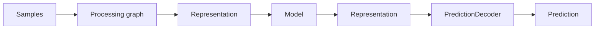
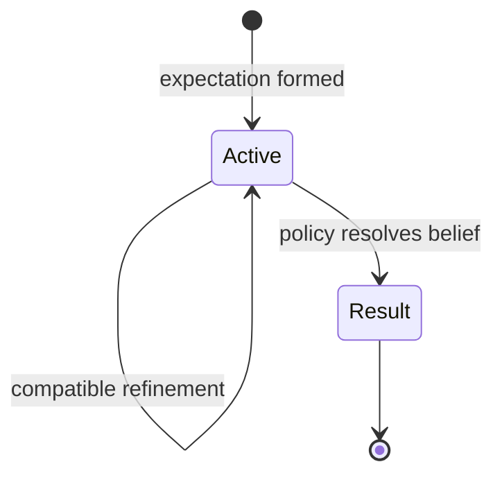
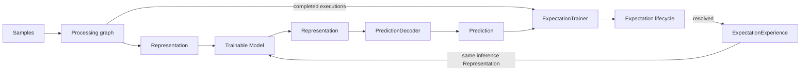
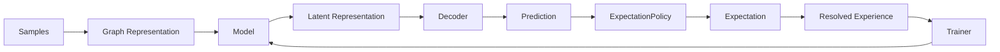

# Predictions and Expectations

This document defines the current prediction/expectation boundary in Skynvættr core.

## Model output and decoding

Models do not directly produce domain objects such as `Prediction<T>`.

A graph model consumes and produces the generic latent `Representation` type:

This keeps learned model components independent of concrete signal semantics. A model may later feed several decoders or other downstream model components without changing its core contract.

`PredictionDecoder<T>` interprets compatible model output as a prediction for one `Signal<T>`. The current training loop also asks the decoder to map an observed target value back into the model's output representation space. This keeps inference and training on the same latent boundary while leaving signal/domain meaning outside the model itself.

## Prediction

`Prediction<T>` is a decoded value for one `Signal<T>` together with the current confidence associated with that decoded prediction.

Confidence is normalized to `0.0..1.0`. It describes support for the prediction; it does **not** mean that the runtime has committed to believing it, and it is not necessarily a calibrated probability of correctness.

Predictions deliberately have no mandatory target timestamp or fixed forecast horizon. Timing and other temporal semantics belong to the learned/runtime process around a prediction rather than to the value type itself.

## Expectation policy

A decoded prediction may be considered by an `ExpectationPolicy<T>`. The policy owns decisions such as:

- whether it supports the decoded prediction type;
- how much confidence is needed before committing;
- whether a prediction should create an expectation at all;
- whether recent observed movement is enough to open a low-confidence exploratory expectation while a model is still untrained;
- whether later evidence fulfills or violates an expectation;
- whether later compatible predictions should refine an existing expectation;
- what replay priority or surprise should be associated with the result.

These rules are deliberately not encoded in `Prediction` or `Expectation`.

## Expectation

`Expectation<T>` represents a persistent belief after policy has decided a prediction is worth committing to.

It records:

- the `Signal<T>` the belief concerns;
- `signalInitialValue`, the observed value when the expectation was formed;
- `expectationInitialValue`, the initially expected value;
- the current expected `value`;
- `formedAt`;
- confidence;
- an optional `ExpectationResult` once the expectation is no longer active.

`ExpectationResult` contains an open-ended string value and the timestamp when the expectation stopped being active. Core deliberately does not define a fixed result vocabulary.

## Graph-owned models and trainer discovery

Models belong to the processing graph, not to the trainer.

After a sense cycle completes, the graph exposes the prediction-producing model executions from that cycle. Each execution records the exact latent input representation, model output, decoder and decoded prediction. Trainers receive the completed graph and discover compatible trainable model executions from it.

`ExpectationTrainer<T>` therefore does **not** receive a model instance, target signal, hand-built feature vector, or explicit episode signal list. It discovers the model that actually ran in the graph and retains that execution's exact `Representation` as the training input.

When an expectation resolves, the observed value at the actual resolution point becomes the training target. The decoder maps that value into the model output representation, and the trainer updates the same graph-owned `TrainableModel` instance that produced the prediction.

The elapsed time may differ between experiences; no `+1 minute`, `+5 minute`, or other fixed target horizon is implied.

Episode signal membership is derived from the canonical `SampleStore` history spanning the resolved expectation lifecycle rather than being configured on the trainer.

## Replay

`ExpectationExperience<T>` retains:

- the resolved expectation;
- its `EpisodeDefinition`;
- the trainable model and decoder that produced it;
- the exact inference input `Representation`;
- the observed resolution value;
- generic replay priority.

`WeightedPriorityReplaySelector` is the current generic replay baseline. It samples old experiences according to caller-provided priority with a small floor so low-priority experience remains reachable.

## Current numeric baseline

`OnlineKnnModel` is a dependency-free baseline implementation of `TrainableModel`. It consumes a generic sensory `Representation`, mean-pools variable numbers of positions to a fixed-width vector, and emits a latent one-position representation containing a predicted numeric value and confidence.

`NumericPredictionDecoder` assigns that latent output to a concrete numeric signal.

`NumericExpectationPolicy` is a small horizon-free lifecycle policy for continuous numeric predictions. Stability expectations can be enabled or disabled. The current thermal example disables them.

To avoid a cold-start deadlock when a model has too little experience to produce a sufficiently confident prediction, the numeric policy can use the immediately preceding observation as weak exploratory evidence. If the signal has moved materially, it opens a low-confidence directional expectation in that same direction. The target distance is scale-normalized and at least as large as the policy's normal material-prediction threshold. Once such an exploratory expectation resolves, the resulting experience trains the same graph-owned model that produced the low-confidence prediction.

This bootstrap path is still expectation-driven: it does not train on every next sample, does not introduce a fixed forecast horizon, and does not require scenario-specific feature wiring. It should nevertheless be treated as an exploration baseline rather than a final general solution for every signal type.

## Current boundary

The promoted flow is now:

This revision intentionally establishes only the model/representation/decoder boundary and the minimum graph discovery needed by the expectation-learning experiment. General graph ports, scheduling, dynamic model creation, decoder discovery for previously unseen signal types, richer expectation refinement, and broader bootstrap/exploration strategies remain experiment-driven follow-up work.
