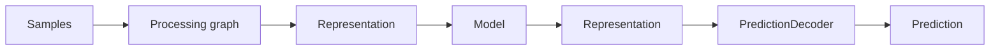
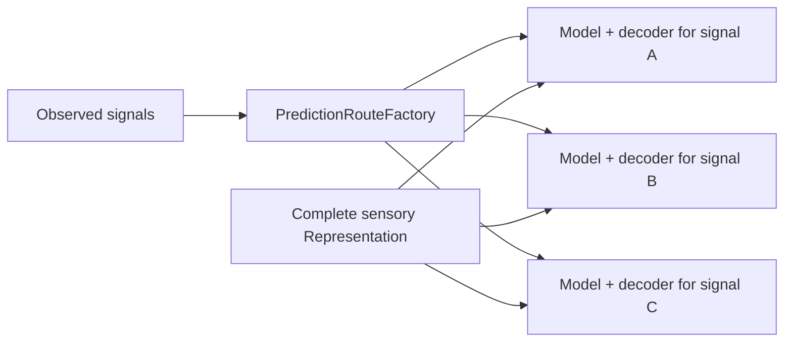
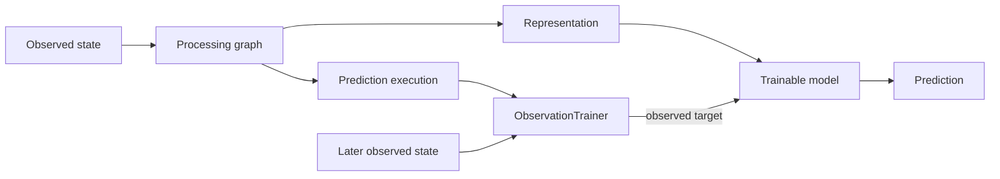
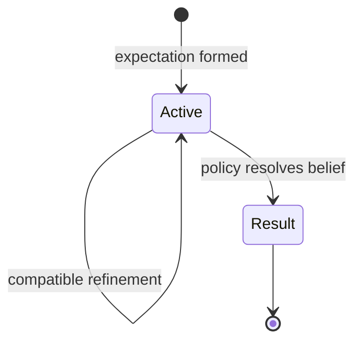
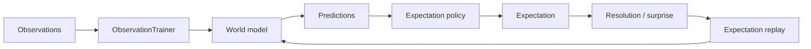
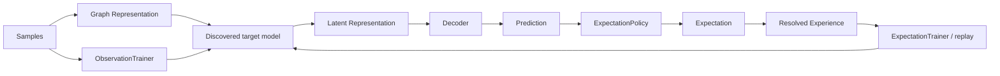

# Predictions and Expectations

This document defines the current prediction/expectation boundary in Skynvættr core.

## Model output and decoding

Models do not directly produce domain objects such as `Prediction<T>`.

A graph model consumes and produces the generic latent `Representation` type:

This keeps learned model components independent of concrete signal semantics. `PredictionDecoder<T>` interprets compatible model output as a prediction for one `Signal<T>` and maps observed training targets back into the model output space.

## Prediction

`Prediction<T>` is a decoded value for one `Signal<T>` together with confidence in `0.0..1.0`.

Predictions deliberately have no mandatory target timestamp or fixed forecast horizon. Confidence describes support for the prediction; it does not mean that the runtime has committed to believing it.

## Dynamic prediction target discovery

`PredictionRouteFactory` is the current discovery boundary. When the sensing graph observes a signal for the first time, compatible factories may create a graph-owned `PredictionRoute` consisting of a model and decoder for that target signal.

The current default experiment uses `DoublePredictionRouteFactory`, which creates one independent numeric predictor route for each observed `Double` signal.

Each target has separate model state/output semantics while every predictor receives the same complete sensory representation, so cross-signal relationships remain learnable.

## Observation-driven learning

Model learning does not depend on an expectation first being formed.

`ObservationTrainer` retains each trainable prediction execution from a completed sense cycle. When the same signal is observed in a later cycle, that observed value becomes a self-supervised target for the exact model and input `Representation` that produced the earlier prediction.

There is no configured `+1`, `+5`, or `+10` minute target. The interval is the actual elapsed time between observations. Temporal structure remains part of the graph-produced representation rather than being encoded as a fixed forecast horizon.

This continuous self-supervised path is the default bootstrap mechanism for learning world dynamics. It also provides the dense training signal needed by future learned sequence models, including learnable Q/K/V projections and attention.

## Expectation policy

A decoded prediction may be considered by an `ExpectationPolicy<T>`. The policy owns decisions such as:

- whether it supports the decoded prediction type;
- how much confidence is needed before committing;
- whether a prediction should create an expectation at all;
- whether later evidence fulfills or violates an expectation;
- whether later compatible predictions should refine an existing expectation;
- what replay priority or surprise should be associated with the result.

`NumericExpectationPolicy` maintains observed range state per signal rather than globally, so unrelated numeric scales do not affect one another's thresholds.

Low-confidence local movement no longer creates exploratory bootstrap expectations. With stability expectations disabled, an expectation is created only when the model produces a sufficiently confident, materially different prediction.

## Expectation

`Expectation<T>` represents a persistent belief after policy has decided a prediction is worth committing to.

It records the signal, `signalInitialValue`, stable `expectationInitialValue`, current expected `value`, `formedAt`, confidence, and an optional `ExpectationResult` once the expectation is closed.

## Expectations as additional learning signal

Expectations are no longer a prerequisite for training, but resolved expectations remain useful experiences.

`ExpectationTrainer<T>` discovers the exact graph-owned model execution that produced a committed prediction. When the expectation resolves, it records an `ExpectationExperience<T>` and may train/replay that experience with priority based on fulfillment, violation, surprise, or another policy-defined measure.

This separates two concerns:

- ordinary observations teach the model how the world behaves;
- expectations record what the entity believed and provide an additional significance/surprise signal when those beliefs resolve.

## Current numeric baseline

`OnlineKnnModel` is a dependency-free baseline `TrainableModel`. It now compares complete ordered representation sequences instead of mean-pooling them, preserving signal/value/time bindings and observation order during nearest-neighbour lookup.

This remains a baseline, not the intended final sequence architecture. Core already contains a `ScaledDotProductAttention` primitive, while learned Q/K/V projections and richer trainable attention models remain follow-up work.

`NumericPredictionDecoder` assigns model output to a concrete numeric signal. The thermal and kitchen examples configure only the generic `DoublePredictionRouteFactory`; neither scenario declares its signals as prediction targets.

## Current boundary

The promoted flow is:

Automatic target discovery currently covers `Double` signals. General graph ports, scheduling, shared-backbone/multi-head learning, learned attention/QKV, non-Double decoder factories and richer expectation refinement remain experiment-driven follow-up work.
