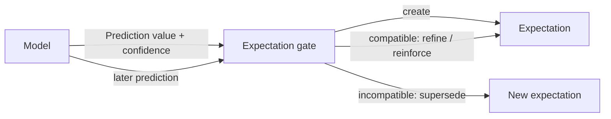
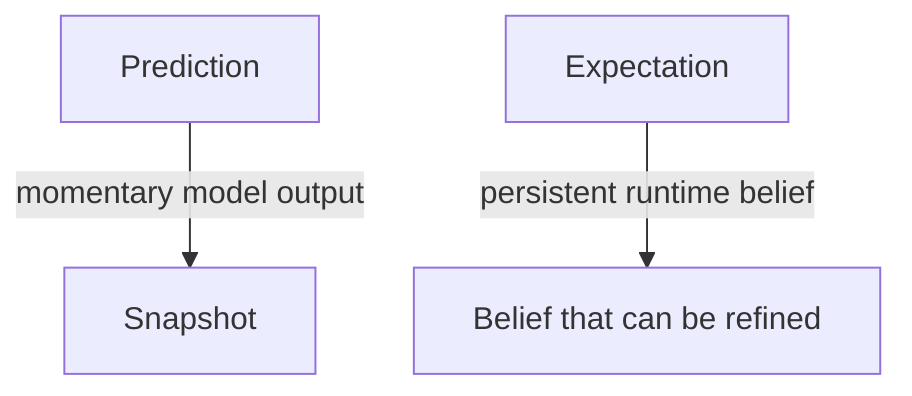

# Predictions and Expectations

This document defines the minimal prediction/expectation boundary currently promoted into Skynvættr core.

## Prediction

`Prediction<T>` is a model-produced value for one `Signal<T>` together with the model's current confidence in that prediction.

Confidence is normalized to `0.0..1.0`. It describes the model's own support for the prediction; it does **not** mean that the runtime has committed to believing it, and it is not necessarily a calibrated probability of correctness.

Predictions deliberately have no creation time, mandatory target timestamp, or fixed forecast horizon. Timing, ordering and other temporal semantics belong to the model/runtime context around a prediction rather than to the value type itself.

## Expectation gate

A prediction may be considered by an expectation gate. The gate owns policy such as:

- how much model confidence is needed before committing;
- whether a new prediction should create an expectation;
- whether a later prediction is compatible with an existing expectation;
- whether a compatible prediction should refine the expected value, reinforce confidence, or both;
- whether an incompatible prediction should supersede the existing expectation;
- whether a prediction is sufficiently recent or otherwise eligible;
- how much it should cost to hold the expectation;
- how much reward fulfillment should represent.

Compatibility is intentionally policy-level rather than simple value equality. For example, a temperature prediction moving from `21.0` to `21.2` may refine the same expectation, while a binary state changing from `true` to `false` may represent an incompatible belief.

These rules are deliberately not encoded in `Prediction` or `Expectation`.

## Expectation

`Expectation<T>` represents a persistent belief after the expectation gate has decided a model prediction is worth committing to.

Unlike a `Prediction`, it is not a frozen snapshot of one model output. It records:

- the `Signal<T>` the belief concerns;
- the currently expected value;
- when the expectation was first formed;
- `cost`, representing how expensive the commitment is;
- `reward`, representing the value of fulfillment;
- the current expectation confidence.

Compatible later predictions may cause the gate to refine the value and confidence while preserving the same expectation and its original `formedAt`. Core deliberately does not provide a built-in `reinforcedBy(...)` operation because deciding compatibility and update semantics is gate/policy behavior.

## Current boundary

The intended flow is:

The distinction is therefore:

This PR intentionally stops here. Violation detection, surprise, experience records, fulfillment evaluation, reward delivery, lifecycle/expiry and replay policy should be introduced only when experiments establish useful semantics for them.
