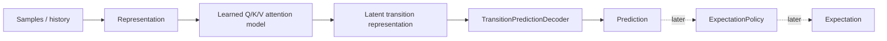
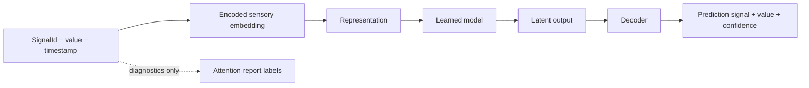
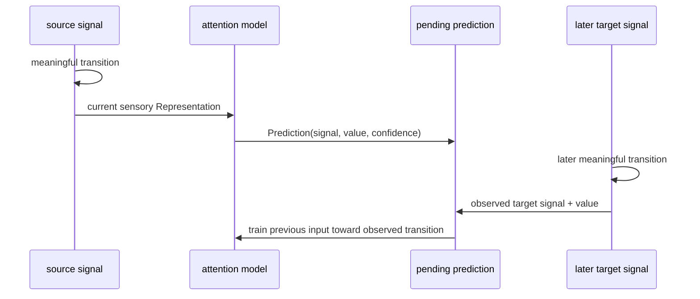
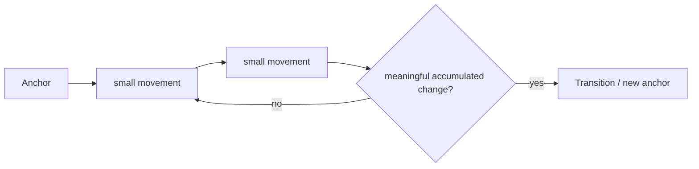
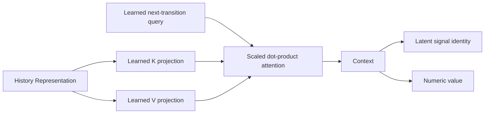
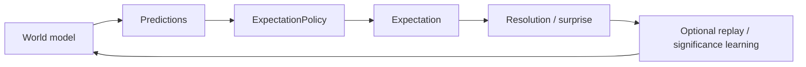

# Predictions and Expectations

This document defines the current prediction/expectation boundary in Skynvættr core and the active learning experiment.

## Current experiment: learn predictions before expectations

The thermal and kitchen examples currently stop at `Prediction`. They intentionally do **not** create `Expectation` instances while we validate whether a learned attention model can discover useful temporal relationships and predict the next meaningful transition.

Expectation types, policies, results and replay infrastructure remain in core for later use; they are not removed by this experiment.

## Representation and signal identity

Each sensory position is encoded from signal identity, scalar value and actual relative time. `Representation` itself remains a generic sequence of embeddings and does not carry symbolic `SignalId` fields.

The signal identity embedding is nevertheless part of the numeric representation seen by the model. This allows learned model output to contain a latent signal identity that can later be decoded back to a known signal.

Diagnostic metadata (`SensoryPosition`) is kept alongside the representation only so reports can label attention weights with the original signal and timestamp. Prediction decoding does not use that metadata to choose a target signal.

## Horizon-free next-transition prediction

`Prediction<T>` deliberately has no mandatory target timestamp or configured `+N` horizon.

The active self-supervised objective is event-conditioned: after a meaningful transition, the model predicts the next meaningful numeric transition. When that later transition is actually observed, its signal identity and value become the training target for the earlier model input.

This differs from the earlier next-sense-cycle objective, which accidentally behaved like a hidden polling-interval horizon and overrepresented plateaus.

## Meaningful transitions

`NumericTransitionDetector` is the current generic baseline. It measures accumulated movement from the last accepted transition anchor rather than requiring one large sample-to-sample jump.

A discrete dimmer change may therefore transition immediately, while many small thermal movements can accumulate into a transition.

The current range-fraction threshold is an experimental baseline, not intended as the final salience mechanism.

## Learned attention baseline

`LearnedAttentionTransitionModel` is intentionally smaller than a Transformer. It uses:

- a learned global query representing “what meaningful transition happens next?”;
- learned key projections for every sensory position;
- learned value projections for every sensory position;
- scaled dot-product attention;
- a learned output head for latent signal identity and numeric value.

This is an inspectable Q/K/V baseline rather than the final model architecture. A later model may use context-dependent queries, multiple heads, shared backbones or longer-lived memory.

## Decoding target signal identity

`TransitionPredictionDecoder` observes which numeric signals currently exist, but does not decide the target signal from input metadata.

The model output contains a latent signal-identity vector. The decoder matches that vector against embeddings of known signals and returns the nearest signal together with decoded value and confidence.

That means the learner must actually discover that a context such as a dimmer transition should map to `state.kitchen.light`; the decoder cannot obtain that answer from report metadata.

## Inspectability

The examples report days 1, 3, 5 and 10 so learning can be inspected over time.

Two diagnostics are produced per snapshot:

1. **Attention heatmap** — average attention mass grouped by source signal and observation age.
2. **Target-signal matrix** — normalized actual-vs-predicted next-transition signal identity.

Age buckets in the heatmap are reporting-only. The model receives actual relative times within the existing sensing-history window.

Attention is not treated as proof of causality. It tells us what the model weighted while making a prediction; prediction accuracy and later ablation experiments provide stronger evidence that a relationship is actually being used.

## Expectations remain a separate layer

`Expectation<T>`, `ExpectationResult`, `ExpectationPolicy<T>`, `NumericExpectationPolicy`, `ExpectationTrainer` and replay infrastructure remain available in core.

They represent a different concern: deciding when a model-produced prediction is important and reliable enough for the running Skynvættr to retain as a persistent belief.

The intended later layering remains:

We are intentionally postponing that layer until the prediction/QKV path is sufficiently understood.
