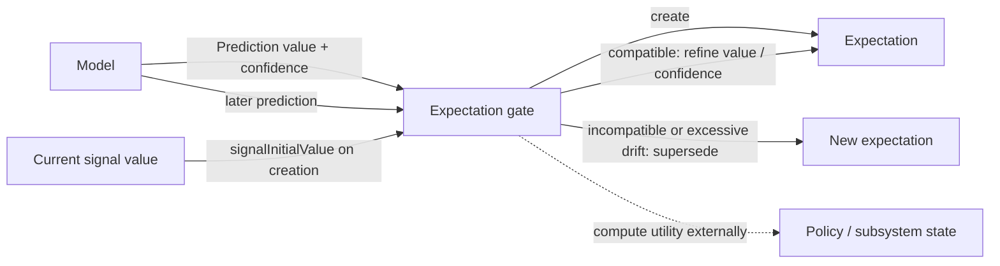
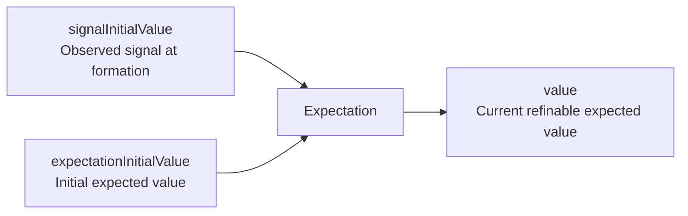

# Predictions and Expectations

This document defines the minimal prediction/expectation boundary currently promoted into Skynvættr core.

## Prediction

`Prediction<T>` is a model-produced value for one `Signal<T>` together with the model's current confidence in that prediction.

Confidence is normalized to `0.0..1.0`. It describes the model's own support for the prediction; it does **not** mean that the runtime has committed to believing it, and it is not necessarily a calibrated probability of correctness.

Predictions deliberately have no creation time, mandatory target timestamp, or fixed forecast horizon. Timing, ordering and other temporal semantics belong to the model/runtime context around a prediction rather than to the value type itself.

## Expectation gate

A prediction may be considered by an expectation gate. The gate owns policy such as:

- how much model confidence is needed before committing;
- whether a new prediction should create an expectation;
- whether a later prediction is compatible with an existing expectation;
- whether a compatible prediction should refine the expected value, reinforce confidence, or both;
- whether an incompatible prediction should supersede the existing expectation;
- whether a prediction is sufficiently recent or otherwise eligible;
- what utility, cost or reward should be associated with creating, maintaining, fulfilling or violating an expectation.

Compatibility is intentionally policy-level rather than simple value equality. For example, a temperature prediction moving from `21.0` to `21.2` may refine the same expectation, while a binary state changing from `true` to `false` may represent an incompatible belief.

The gate may also compare the current refined value with `expectationInitialValue`. If the belief has drifted too far from what was initially expected, policy may choose to supersede it rather than continually move the target. How much drift is acceptable, and any additional cost associated with superseding, remain policy decisions.

These rules are deliberately not encoded in `Prediction` or `Expectation`.

## Expectation

`Expectation<T>` represents a persistent belief after the expectation gate has decided a model prediction is worth committing to.

Unlike a `Prediction`, it is not a frozen snapshot of one model output. It records the belief state and stable reference points needed by core:

- the `Signal<T>` the belief concerns;
- `signalInitialValue`, the observed value of that same signal when the expectation was formed;
- `expectationInitialValue`, the initially expected value, equal to `value` when the expectation is created;
- `value`, the currently expected value;
- when the expectation was first formed;
- the current expectation confidence.

Compatible later predictions may cause the gate to refine `value` and confidence while preserving `signalInitialValue`, `expectationInitialValue` and the original `formedAt`. This preserves both where reality started and what the belief originally committed to, which can later support visualization and policy-level evaluation without allowing gradual refinement to erase the original prediction.

Core deliberately does not provide a built-in `reinforcedBy(...)` operation because deciding compatibility and update semantics is gate/policy behavior.

Cost, reward and other utility calculations are intentionally external. They depend on the subsystem, environment or policy evaluating the expectation rather than being intrinsic properties of the belief itself.

## Current boundary

The intended flow is:

The stable reference points are:

This PR intentionally stops here. Violation detection, surprise, experience records, fulfillment evaluation, utility/reward delivery, lifecycle/expiry and replay policy should be introduced only when experiments establish useful semantics for them.
