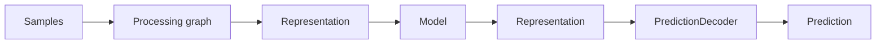
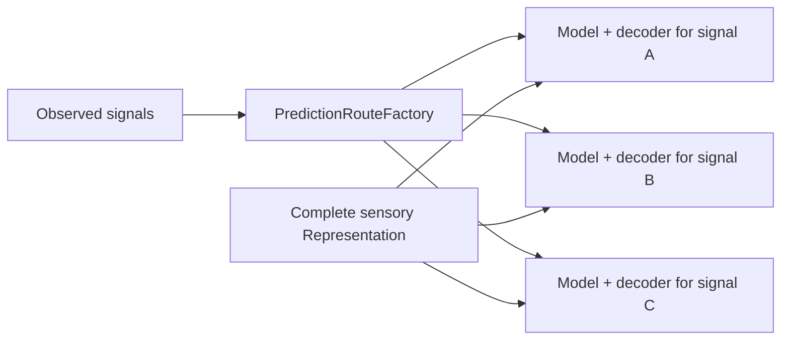
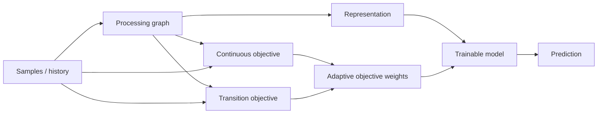
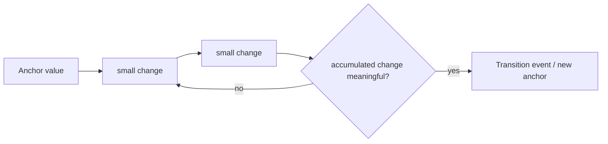
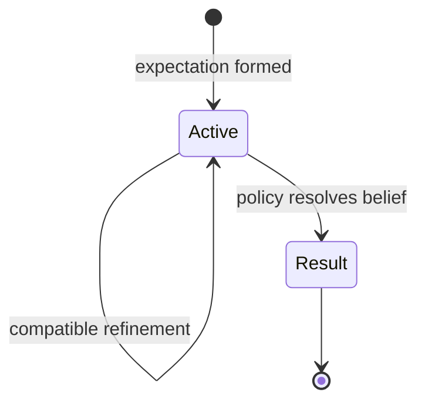
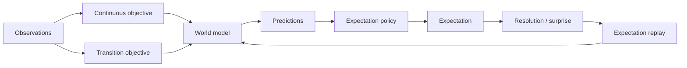
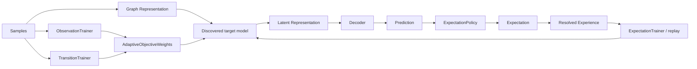

# Predictions and Expectations

This document defines the current prediction/expectation boundary in Skynvættr core.

## Model output and decoding

Models do not directly produce domain objects such as `Prediction<T>`.

A graph model consumes and produces the generic latent `Representation` type:

This keeps learned model components independent of concrete signal semantics. `PredictionDecoder<T>` interprets compatible model output as a prediction for one `Signal<T>` and maps observed training targets back into the model output space.

## Prediction

`Prediction<T>` is a decoded value for one `Signal<T>` together with confidence in `0.0..1.0`.

Predictions deliberately have no mandatory target timestamp or fixed forecast horizon. Confidence describes support for the prediction; it does not mean that the runtime has committed to believing it.

## Dynamic prediction target discovery

`PredictionRouteFactory` is the current discovery boundary. When the sensing graph observes a signal for the first time, compatible factories may create a graph-owned `PredictionRoute` consisting of a model and decoder for that target signal.

The current default experiment uses `DoublePredictionRouteFactory`, which creates one independent numeric predictor route for each observed `Double` signal.

Each target has separate model state/output semantics while every predictor receives the same complete sensory representation, so cross-signal relationships remain learnable.

## Adaptive multi-objective self-supervision

Model learning does not depend on an expectation first being formed, and no single self-supervised objective owns a signal permanently.

The current numeric baseline runs two objectives in parallel:

- `ObservationTrainer` learns from ordinary continuous change between observations. Exact plateaus are skipped because persistence already predicts them perfectly and they otherwise overwhelm sparse dynamics.
- `TransitionTrainer` detects meaningful accumulated numeric transitions. A transition on any signal captures the current graph context; when a target signal later transitions, that earlier context is trained toward the new target value. This allows experiences such as `dimmer change -> later light change` without configuring either signal as a cause or target.

`AdaptiveObjectiveWeights` evaluates each objective relative to a no-change persistence baseline. Long plateaus therefore do not make an objective look useful merely because predicting no change is easy. When a meaningful target change occurs, an objective receives positive skill only if its prediction improves on persistence.

Weights remain soft and bounded away from zero. This is deliberate: the system does not perform a permanent hand-off from one learning regime to another. A signal may be mostly continuous in one context and transition-dominated in another, and both objectives can remain useful.

The current weighting state is tracked per signal. Context-local routing and learned objective selection are possible future refinements once experiments justify the added complexity.

## Transition detection

`NumericTransitionDetector` measures movement from the last accepted transition anchor rather than only the immediately preceding sample.

This means a discrete signal such as a dimmer may transition immediately from `0.2 -> 0.8`, while a thermal signal can accumulate many small changes until they together cross the same relative threshold.

The detector is a generic numeric baseline, not a claim that a fixed range fraction is the final notion of salience. Learned noise/change models may replace it later.

## Why this is not a fixed next-step horizon

The earlier `ObservationTrainer` version trained every execution against the value seen in the next sense cycle. In a five-minute simulation this accidentally behaved like a hidden `+5 minute` target and heavily overrepresented unchanged plateaus.

The continuous objective now ignores exact plateaus, while the transition objective waits for an actual meaningful state change. Transition learning is therefore event-conditioned rather than tied to the runtime polling interval.

The current per-signal scalar model still predicts values rather than a full general transition event. A future transition head may additionally predict which signal transitions next and an elapsed-time distribution.

## Expectation policy

A decoded prediction may be considered by an `ExpectationPolicy<T>`. The policy owns decisions such as:

- whether it supports the decoded prediction type;
- how much confidence is needed before committing;
- whether a prediction should create an expectation at all;
- whether later evidence fulfills or violates an expectation;
- whether later compatible predictions should refine an existing expectation;
- what replay priority or surprise should be associated with the result.

`NumericExpectationPolicy` maintains observed range state per signal rather than globally, so unrelated numeric scales do not affect one another's thresholds.

Low-confidence local movement no longer creates exploratory bootstrap expectations. With stability expectations disabled, an expectation is created only when the model produces a sufficiently confident, materially different prediction.

## Expectation

`Expectation<T>` represents a persistent belief after policy has decided a prediction is worth committing to.

It records the signal, `signalInitialValue`, stable `expectationInitialValue`, current expected `value`, `formedAt`, confidence, and an optional `ExpectationResult` once the expectation is closed.

## Expectations as additional learning signal

Expectations are not a prerequisite for training, but resolved expectations remain useful experiences.

`ExpectationTrainer<T>` discovers the exact graph-owned model execution that produced a committed prediction. When the expectation resolves, it records an `ExpectationExperience<T>` and may reinforce/replay that experience with priority based on fulfillment, violation, surprise, or another policy-defined measure.

This separates two concerns:

- ordinary observations and transitions teach the model how the world behaves;
- expectations record what the entity believed and provide an additional significance/surprise signal when those beliefs resolve.

## Current numeric baseline

`OnlineKnnModel` is a dependency-free baseline `TrainableModel`. It compares complete ordered representation sequences instead of mean-pooling them, preserving signal/value/time bindings and observation order during nearest-neighbour lookup.

Training examples retain real fractional weights. Objective weighting therefore changes neighbour contribution directly rather than being approximated by duplicated examples.

This remains a baseline, not the intended final sequence architecture. Core already contains a `ScaledDotProductAttention` primitive, while learned Q/K/V projections and richer trainable attention models remain follow-up work. The multi-objective training boundary is intended to provide useful supervision for such a shared representation/attention backbone later.

`NumericPredictionDecoder` assigns model output to a concrete numeric signal. The thermal and kitchen examples configure only the generic `DoublePredictionRouteFactory`; neither scenario declares its signals as prediction targets.

## Current boundary

The promoted flow is:

Automatic target discovery and the current adaptive objectives currently cover `Double` signals. General graph ports, scheduling, shared-backbone/multi-head learning, learned attention/QKV, non-Double decoder factories, context-local objective routing, general next-transition heads and richer expectation refinement remain experiment-driven follow-up work.
