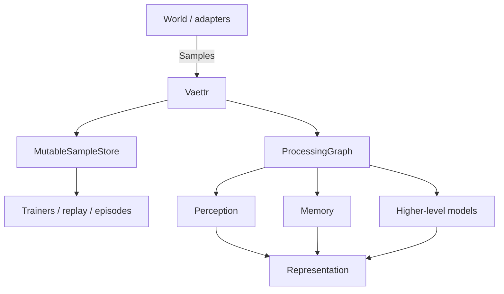
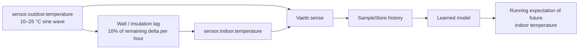

# Representations and processing primitives

Skynvættr treats a running `Vaettr` as the external entry point and keeps its internal processing topology replaceable.



`Vaettr.sense(...)` is the canonical observation ingress for both simulations and live adapters. Every received sample is persisted to the configured `MutableSampleStore` before the processing graph runs. Trainers are notified only after that sense cycle has completed, so online processing and later learning share one historical source of truth.

`ProcessingGraph` is the topology boundary. Implementations may be linear pipelines or arbitrary directed graphs with fan-out, feedback loops, stateful modules, independent update schedules, and learned components. Core does not yet prescribe ports, scheduling, or module lifecycle.

Experiments therefore exercise Skynvættr through the same top-level API rather than invoking isolated model classes directly:

```kotlin
val vaettr = Vaettr()

world.simulate(...) { samples ->
    vaettr.sense(samples)
}
```

The same shape also fits an event-driven integration such as Home Assistant: `sense(...)` may be called at a fixed cadence or whenever one or more sensors update.

## Minimal thermal expectation scenario

`ThermalExpectationScenarioTest` is an executable example of the first learning problem this runtime should support.



Outdoor temperature follows a 24-hour sine wave between 10 °C and 25 °C. Indoor temperature moves toward the current outdoor temperature with a default hourly delta fraction of 10%. The implementation uses exponential retention rather than a naive fixed-per-step update, so the thermal time constant remains approximately stable if the sensing interval changes.

The scenario feeds only the two sensor streams into `Vaettr`. It deliberately contains no hand-coded predictor and does not expose the thermal equation to the processing graph. Its intended learning objective is for a later learned model to develop a continuously updated expectation of how `sensor.indoor.temperature` will evolve from accumulated experience.

## Canonical sample history

`SampleStore` is the read boundary for historical observations. `MutableSampleStore` adds ingestion, and `InMemorySampleStore` is the initial process-local implementation used by experiments and the default runtime.

The store is deliberately an observation history, not inferred state. A `Sample` does not imply that its value remains valid until another sample arrives. This matters for event-driven sensors: consumers should retain actual timestamps instead of silently forward-filling observations unless a signal-specific state model explicitly chooses to do so.

The same store is intended to support online perception, episode construction, replay/dreaming and trainer sampling so those systems do not maintain competing histories.

## Trainers

A `Trainer` is attached to a running `Vaettr` and receives `onSenseCompleted(samples)` after the current sense cycle has persisted its samples and the processing graph has completed.

The trainer owns its training policy: it may train on every completed sense cycle, after enough new experience exists, when observed timestamps cross a simulated/runtime boundary such as a new day, or not at all. It may later use `EpisodeStore` plus `SampleStore` to select historical experience and train the model instances it owns.

The current notification hook is deliberately only a lifecycle boundary. It should not be interpreted as requiring all training to happen synchronously inside `sense()`. Trainers that need wall-clock schedules independent of sensory updates will need a runtime clock/scheduler attachment in a later revision; that scheduling mechanism belongs to the trainer/runtime lifecycle rather than the sensing graph.

## Default sensing graph

`SensingProcessingGraph` carries forward the generic sensory-input structure that performed best in the temporal relation-discovery experiments without promoting experiment-specific predictors or targets into core.

It reads historical observations from the canonical `SampleStore` and offers every signal the same generic log-spaced history ages used in those experiments:

```text
5120, 2560, 1280, 640, 320, 160, 80, 60, 40, 30, 20, 15, 10, 5, 0 seconds
```

For event-driven input, selected samples keep their actual timestamp; the graph does not pretend a sample remained the current state at one of the requested history ages. Duplicate selections are collapsed.

Each selected observation becomes one position containing:

```text
[ signal identity embedding | scalar value | normalized relative time ]
```

The default currently supports numeric and boolean sample values because those are the value domains exercised by the promoted playpen experiments. Other value encodings should be introduced through evidence rather than guessed in core.

The graph deliberately stops at this generic input `Representation`. The strongest playpen attention result used normalized values plus learned input/key/value projections and a learned latent query trained from a prediction objective. Applying scaled dot-product attention directly to raw sensory vectors would therefore be a different, unvalidated model. Learned contextualization belongs in later graph components once training/model ownership is established.

## Representation

`Representation` is the generic internal numeric form exchanged between model components. It is a two-dimensional sequence of positions × dimensions. Core deliberately assigns no semantic meaning to either axis: positions may represent observations, tokens, time steps, memory slots, or another learned structure.

`Embedding` is one fixed-width vector, and therefore one row/position of a `Representation`.

This boundary is intentionally close to the tensor-like hidden-state representation used inside neural models. Human-readable identities and diagnostics do not need to be decoded and re-encoded between every internal component.

## Signal identity embedding

`Embedder<T>` defines a replaceable boundary for components that produce embeddings. Training is intentionally not part of the interface: implementations may be deterministic or learned.

`SignalIdentityEmbedder` is the current source-agnostic baseline. It tokenizes a `SignalId`, encodes each lexical token using the existing `TokenEncoder`, and mean-pools those token representations into one signal-identity embedding. With the default `DeterministicByteTokenEncoder`, this is not a learned semantic embedding; it is a stable compositional representation on which learned components can build.

Tokenization and signal embedding are not global Skynvættr pipeline stages. They are primitives a perception implementation may use internally.

## Attention

`Attention` defines a replaceable operation over query, key, and value `Representation` values.

`ScaledDotProductAttention` is the current baseline implementation and computes:

```text
softmax(Q K^T / sqrt(d_k)) V
```

It deliberately does not own Q/K/V projection matrices, optimizer state, prediction heads, normalization, or training policy. Those remain concerns of the model/module using attention.

## Current boundary

This revision establishes:

- `Vaettr` as the external sensory entry point;
- `MutableSampleStore` as the canonical observation history written before processing;
- `Trainer` as the owner of when training should run after a completed sense cycle;
- `ProcessingGraph` as the replaceable internal topology boundary;
- `SensingProcessingGraph` as the initial default sensory front-end;
- `Representation`/`Embedding` as generic latent numeric data;
- replaceable embedding and attention contracts with current baseline implementations.

It does not yet define graph ports, graph scheduling, a module interface, a Transformer, working-memory semantics, effector routing, an optimizer, model discovery or a full training lifecycle. Those should be introduced from experiments that exercise the `Vaettr` entry point rather than designed in isolation.
