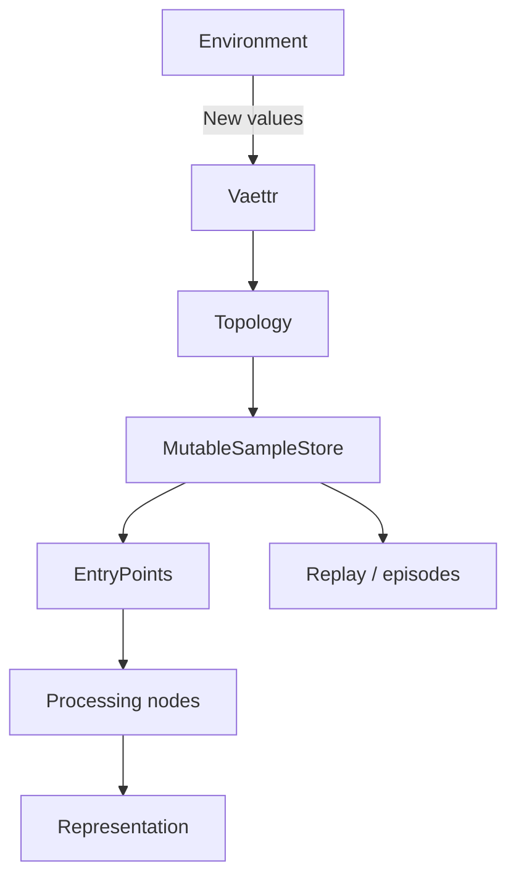
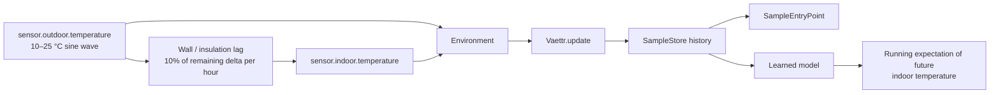

# Representations and processing primitives

Skynvættr treats a running `Vaettr` as the update orchestrator and keeps its typed entrypoints replaceable.
The port-and-synapse topology is described in [Processing topology](topology.md).
The concrete reference network is described in [Default topology](default-topology.md).



`Vaettr` holds an `Environment` and a `Topology`, defaulting to `DefaultTopology`. On each `update()`,
it delegates to `Topology.update()`. `DefaultTopology` discovers typed `EntryPoint<T>` nodes, asks the
environment for new values once per input type, stores each sample batch once in its canonical
`MutableSampleStore`, and passes non-empty batches to matching entrypoints. Entrypoints emit
representations through their ports; they do not return a representation from `process(...)`.

`EntryPoint<T>` is the first explicit processing boundary. Its input type defines what it consumes,
while its `process(items: List<T>)` function defines which representations it emits through its ports.
Those ports can feed downstream processing nodes. The current reference wiring is documented in
[Default topology](default-topology.md).

Experiments therefore exercise Skynvættr through the same top-level API rather than invoking isolated model classes directly:

```kotlin
val world = ThermalExpectationScenario()
val vaettr = Vaettr(world)

world.simulate(vaettr, ...)
```

The same shape also fits an event-driven integration such as Home Assistant: `update()` may be
called at a fixed cadence or whenever the environment has new values.

## Minimal thermal expectation scenario

`ThermalExpectationScenarioTest` is an executable example of the first learning problem this runtime should support.



Outdoor temperature follows a 24-hour sine wave between 10 °C and 25 °C. Indoor temperature moves toward the current outdoor temperature with a default hourly delta fraction of 10%. The implementation uses exponential retention rather than a naive fixed-per-step update, so the thermal time constant remains approximately stable if the sensing interval changes.

The scenario feeds only the two sensor streams into the `Environment`. It deliberately contains no hand-coded predictor and does not expose the thermal equation to the `SampleEntryPoint`. Its intended learning objective is for a later learned model to develop a continuously updated expectation of how `sensor.indoor.temperature` will evolve from accumulated experience.

## Canonical sample history

`SampleStore` is the read boundary for historical observations. `MutableSampleStore` adds ingestion, and `InMemorySampleStore` is the initial process-local implementation used by experiments and the default runtime.

The store is deliberately an observation history, not inferred state. A `Sample` does not imply that its value remains valid until another sample arrives. This matters for event-driven sensors: consumers should retain actual timestamps instead of silently forward-filling observations unless a signal-specific state model explicitly chooses to do so.

The same store is intended to support online perception, episode construction, replay/dreaming and trainer sampling so those systems do not maintain competing histories.

## Trainers

Training integration is not currently attached to `Vaettr.update()`. A future trainer lifecycle may
consume representations, canonical sample history, or both. Its scheduling and ownership semantics
remain open.

## Default sample entrypoint

`SampleEntryPoint` carries forward the generic sensory-input structure that performed best in the temporal relation-discovery experiments without promoting experiment-specific predictors or targets into core.

It reads the canonical `SampleStore` populated by `DefaultTopology` and offers every signal the same
generic log-spaced history ages used in those experiments:

```text
5120, 2560, 1280, 640, 320, 160, 80, 60, 40, 30, 20, 15, 10, 5, 0 seconds
```

For event-driven input, selected samples keep their actual timestamp; the entrypoint does not
pretend a sample remained the current state at one of the requested history ages. Duplicate
selections are collapsed.

Each selected observation becomes one position containing:

```text
[ signal identity embedding | scalar value | normalized relative time ]
```

The default currently supports numeric and boolean sample values because those are the value domains exercised by the promoted playpen experiments. Other value encodings should be introduced through evidence rather than guessed in core.

The entrypoint deliberately stops at this generic input `Representation`. The strongest playpen
attention result used normalized values plus learned input/key/value projections and a learned
latent query trained from a prediction objective. The initial topology can connect identity Q/K/V
projections to scaled dot-product attention as an inspectable baseline, but that is not presented as
the validated learned model. Learned contextualization belongs in later processing components once
training and model ownership are established.

## Representation

`Representation` is the generic internal numeric form exchanged between model components. It is a two-dimensional sequence of positions × dimensions. Core deliberately assigns no semantic meaning to either axis: positions may represent observations, tokens, time steps, memory slots, or another learned structure.

`Embedding` is one fixed-width vector, and therefore one row/position of a `Representation`.

This boundary is intentionally close to the tensor-like hidden-state representation used inside neural models. Human-readable identities and diagnostics do not need to be decoded and re-encoded between every internal component.

## Signal identity embedding

`Embedder<T>` defines a replaceable boundary for components that produce embeddings. Training is intentionally not part of the interface: implementations may be deterministic or learned.

`SignalIdentityEmbedder` is the current source-agnostic baseline. It tokenizes a `SignalId`, encodes each lexical token using the existing `TokenEncoder`, and mean-pools those token representations into one signal-identity embedding. With the default `DeterministicByteTokenEncoder`, this is not a learned semantic embedding; it is a stable compositional representation on which learned components can build.

Tokenization and signal embedding are not global Skynvættr pipeline stages. They are primitives a perception implementation may use internally.

## Attention

`Attention` defines a replaceable operation over query, key, and value `Representation` values.

`ScaledDotProductAttention` is the current baseline implementation and computes:

```text
softmax(Q K^T / sqrt(d_k)) V
```

It deliberately does not own Q/K/V projection matrices, optimizer state, prediction heads, normalization,
or training policy. Separate projection stages can provide Q/K/V inputs, and their parameter ownership
remains outside the attention operation. See [Default topology](default-topology.md) for the current
reference projection nodes.

## Current boundary

This revision establishes:

- `Environment` as the provider of newly available values;
- `Vaettr` as the update orchestrator;
- `Topology` and `DefaultTopology` as the node and entrypoint orchestration boundary;
- `EntryPoint<T>` as the typed processing boundary;
- `SampleEntryPoint` as the initial default sensory front-end;
- Q/K/V projection nodes and `AttentionNode` as the initial attention pipeline;
- synchronous ports, synapses, and Graphviz topology rendering;
- the `DefaultTopology`-owned `MutableSampleStore` as the canonical observation history populated
  before entrypoint processing;
- `Representation`/`Embedding` as generic latent numeric data;
- replaceable embedding and attention contracts with current baseline implementations.

It does not yet define asynchronous scheduling, a module interface, a Transformer, working-memory
semantics, effector routing, an optimizer, model discovery or a full training lifecycle. Those should
be introduced from experiments that exercise `Vaettr.update()` rather than designed in isolation.
