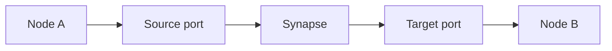
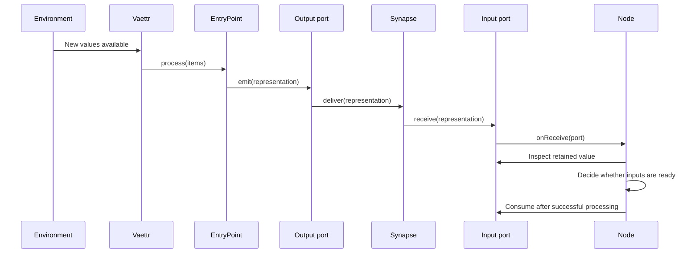
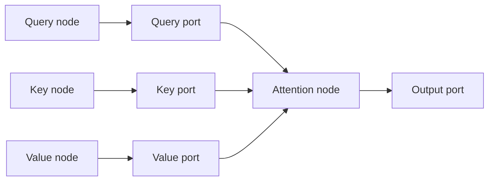

# Processing topology

This document defines the topology contracts and the design questions around them. The current
concrete composition is documented separately in [Default topology](default-topology.md).

## Boundary

`Vaettr` delegates each update to a `Topology`. A topology exposes its nodes and derived entrypoints,
advances its network through `update()`, and leaves the concrete polling and scheduling policy to its
implementation.

## Goals

The topology should:

- support nodes with arbitrary numbers of ports;
- make connections explicit and inspectable;
- allow one port to emit to multiple connected ports;
- let ports retain values until their node processes them;
- let each node decide when its inputs are ready;
- support nodes with different input semantics;
- avoid forcing every operation into one input and one output;
- keep scheduling and buffering policy explicit.

## Core concepts

### Node

A **Node** is a processing component that owns ports and subscribes to receive events from the ports
whose input it consumes.

Nodes expose a human-readable `name` used by topology tooling. It defaults to the concrete class name,
but node implementations and instances may provide a more useful label.

The node decides whether to process immediately, wait for other inputs, accumulate state, or take
some other action. The `onReceive` event only tells the node that a port's input state changed; it
does not require immediate processing.

### Port

A **Port** is a named endpoint owned by a node. A port has both sending and receiving capabilities:

- `emit(value)` delivers a value through its outgoing synapses;
- `receive(value)` accepts a value from an incoming synapse;
- `onReceive` notifies subscribers after a value has been accepted;
- `synapses` exposes the port's outgoing connections for topology inspection;
- `connectTo(vararg targets)` creates outgoing synapses.

Buffering policy is deliberately outside the generic port contract. An implementation may retain one
value, queue values, replace an existing value, or use another policy. Nodes should only depend on the
buffering operations exposed by the concrete port policy they are designed to consume.

### Synapse

A **Synapse** is a directed connection from one source port to one target port:



A source port may own several synapses, allowing fan-out. A port does not need to know which node
owns each target port, so node processing remains independent of the topology in which it is placed.

Whether several source ports may connect to one target port should be an explicit topology rule
rather than an accidental side effect.

## Processing lifecycle

A normal synchronous delivery cycle could look like this:



Whether delivery and event publication are synchronous is a topology scheduling choice. Nodes should
not assume that receipt and processing always use the same call stack.

## Multi-input nodes

An attention node is a useful example because it needs three distinct input ports for queries, keys,
and values, plus an output port. It may wait until all three inputs contain compatible values, invoke
an attention operation, consume the inputs after successful computation, and emit the result.



An attention node may subscribe to the receive event of each input port. Once all three contain
values, it can:

1. read the retained query, key, and value representations;
2. perform attention;
3. consume the three input values after successful processing;
4. emit the result through its output port.

This does not imply that every node must wait for all ports. A node may process when any input
arrives, use only the newest value, accumulate multiple values, or apply domain-specific readiness
rules.

## Entry points

An `EntryPoint<T>` is a topology source with a typed external input. Its `process` function emits
through one or more ports instead of returning one representation:

```kotlin
interface EntryPoint<T : Any> : Node {
    val inputType: KClass<T>
    fun process(items: List<T>)
}
```
For example, a sample entrypoint may expose separate ports for:

- raw sample representations;
- signal identity representations;
- temporal context;
- quality or confidence metadata.

The entrypoint decides how the external values are transformed and which outputs it emits. The
topology decides where those outputs go next. A topology implementation may poll an environment,
receive values from another subsystem, or use another scheduling policy; emitted representations can
continue through connected synapses.

## Concrete implementation

The current reference implementation and its report pipeline are described in
[Default topology](default-topology.md).

## Topology ownership

`Topology` exposes `nodes`, named `groups`, a derived read-only `entryPoints` list, and `update()`.
The nodes and their port connections define the network; groups provide named system boundaries for
composition and inspection. A topology implementation may take responsibility for:

- nodes;
- synapses;
- port registration;
- connection validation;
- lifecycle and shutdown;
- possibly scheduling.

Nodes own their ports and processing behavior, but should not need to discover unrelated nodes or
construct their own connections.

## Decisions still needed

### Occupied ports

Port policies may support:

- queues;
- replacement by newest value;
- replacement by highest-priority value;
- dropping new values;
- backpressure or explicit failure propagation.

These should be represented by separate port implementations or named policies, not hidden inside
a generic port.

### Processing failures

The topology needs a policy for whether values remain available after a processing failure, and how
retries, dead letters, or failure propagation should work.

### Multiple sources for one port

Attention generally needs distinct query, key, and value ports. Other nodes may want several source
ports to feed one logical input. The topology needs to define whether that means:

- multiple synapses to one target port;
- a merger node;
- a port that accepts tagged input;
- a port with a queue.

### Scheduling and cycles

Scheduling may need immediate processing, complete-input-set processing, periodic processing, batching,
asynchronous nodes, parallel nodes, and safe handling of feedback cycles without unbounded recursion.

### Representation identity

The topology may eventually need metadata around representations, such as creation time, originating
node and port, sequence number, correlation or batch identifier, and semantic type. This is especially
relevant when several representations arrive at a multi-input node and need to be matched.

## Implementation notes

The topology contract deliberately leaves buffering, scheduling, validation, and multi-input
correlation open. See [Default topology](default-topology.md) for the current reference choices.
