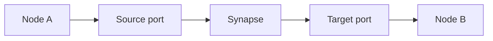
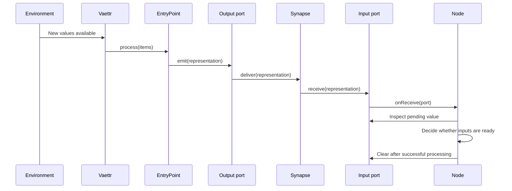
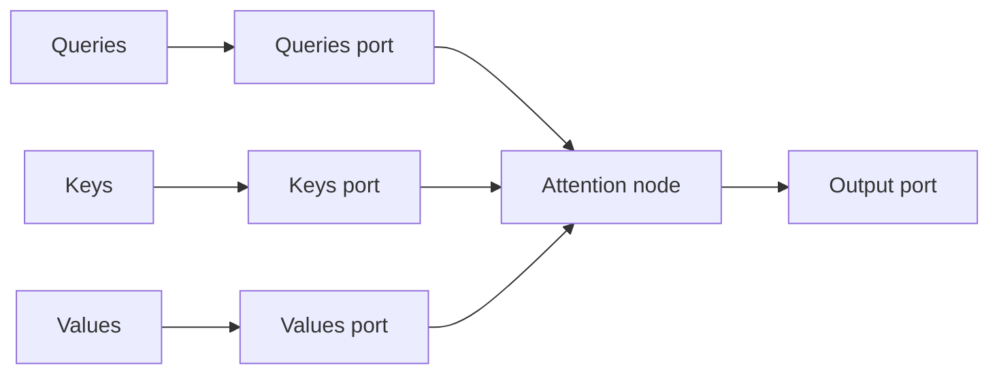

# Processing topology

This document captures the planned processing topology for Skynvættr. It is intentionally
provisional: the goal is to make the boundaries and unresolved semantics explicit before the
implementation is expanded.

## Current boundary

The current runtime has two separate concerns:

- `Environment` provides newly available values to `DefaultTopology`;
- `EntryPoint<T>` processes values of one external type into representations.

`Vaettr.update()` delegates to `Topology.update()`. The initial `DefaultTopology` polls the
environment once per input type and passes each non-empty batch to all matching entrypoints.

`SampleEntryPoint` stores incoming samples, builds representations from their temporal history,
and emits them through its output port.

## Goals

The topology should:

- support nodes with arbitrary numbers of ports;
- make connections explicit and inspectable;
- allow one port to emit to multiple connected ports;
- let ports retain values until their node processes them;
- let each node decide when its inputs are ready;
- support nodes with different input semantics;
- avoid forcing every operation into one input and one output;
- keep scheduling and buffering policy explicit.

## Core concepts

### Node

A **Node** is a processing component that owns ports and subscribes to receive events from the ports
whose input it consumes.

The node decides whether to process immediately, wait for other inputs, accumulate state, or take
some other action. The `onReceive` event only tells the node that a port's input state changed; it
does not require immediate processing.

### Port

A **Port** is a named endpoint owned by a node. A port has both sending and receiving capabilities:

- `emit(representation)` delivers a representation through its outgoing synapses;
- `receive(representation)` accepts a representation from an incoming synapse;
- `onReceive` notifies subscribers after a representation has been accepted;
- `pending` exposes retained input according to the port's buffering policy;
- `clear()` explicitly removes retained input after successful processing.

The first implementation is `SingleSlotPort`:

- it holds zero or one pending `Representation`;
- receiving a value publishes `onReceive`;
- receiving another value while occupied fails;
- the value remains available until the node explicitly clears it.

A single-slot port must not silently overwrite unprocessed input. Queueing, replacement, and other
behaviours can be introduced later as separate port implementations or explicit policies.

### Synapse

A **Synapse** is a directed connection from one source port to one target port:



A source port may own several synapses, allowing fan-out. A port does not need to know which node
owns each target port, so node processing remains independent of the topology in which it is placed.

Whether several source ports may connect to one target port should be an explicit topology rule
rather than an accidental side effect.

## Processing lifecycle

A normal synchronous delivery cycle could look like this:



Delivery and event publication are synchronous in the first implementation. Future scheduling must
not require a node to assume that receipt and processing always use the same call stack.

## Multi-input nodes

An attention node is a useful example because it needs three distinct input ports:

`AttentionNode` is implemented in `attention` and accepts an `Attention` implementation. Its ports
are `q`, `k`, `v`, and the output `attention`. It consumes one representation from each input,
calls `Attention.apply`, clears the inputs after successful computation, and emits `result.output`.
Computation failures retain the inputs. Failures in downstream delivery occur after inputs have
been cleared. Q/K/V projections can be supplied by separate upstream nodes.



The attention node subscribes to the receive event of each input port. Once all three contain
pending values, it can:

1. read the pending query, key, and value representations;
2. perform attention;
3. clear the three ports after successful processing;
4. emit the result through its output port.

This does not imply that every node must wait for all ports. A node may process when any input
arrives, use only the newest value, accumulate multiple values, or apply domain-specific readiness
rules.

## Entry points

An `EntryPoint<T>` is a topology source with a typed external input. Its `process` function emits
through one or more ports instead of returning one representation:

```kotlin
interface EntryPoint : Node {
    val inputType: KClass<T>
    fun process(items: List<T>)
}
```
For example, a sample entrypoint may expose separate ports for:

- raw sample representations;
- signal identity representations;
- temporal context;
- quality or confidence metadata.

The entrypoint decides how the external values are transformed and which outputs it emits. The
topology decides where those outputs go next. `DefaultTopology.update()` orchestrates environment polling
and entrypoint processing; emitted representations continue through connected synapses.

`Vaettr` holds an `Environment` and a `Topology`, defaulting to `DefaultTopology(environment)`.
`DefaultTopology` owns a read-only list of nodes and derives its entrypoints from that list. On each `update()`, it fetches each input type once and passes
non-empty batches to `EntryPoint.process(...)`. Entrypoints emit representations through their
output ports; `Vaettr.update()` does not collect or return those representations.

`EntryPoint<T>` is the first explicit processing boundary. Its input type defines what it consumes,
while its `process(items: List<T>)` function defines how those items become representations emitted
into the processing topology. The topology decides where those outputs go next.

## Report rendering

The example reports include `topology.png`, rendered with Graphviz, and the corresponding
`topology.dot` source. The renderer traverses `Topology.nodes`, each node's `ports`, and each port's
outgoing `synapses`. It draws nodes and directed connections between their owners; ports are not
drawn separately. Multiple connections between the same pair of nodes appear as one arrow.
All nodes, including disconnected nodes, remain visible. Connected nodes must be included in
`Topology.nodes`.

Install Graphviz and make `dot` available on `PATH`, or set `GRAPHVIZ_DOT` to the full path of the
executable. Run `./gradlew renderExampleReports` (or `gradlew.bat renderExampleReports` on Windows).
CI installs Graphviz and includes the topology images alongside the existing report charts.

## Topology ownership

`Topology` exposes `nodes`, a derived read-only `entryPoints` list, and `update()`. The nodes and their
port connections define the network. `DefaultTopology` owns environment polling and entrypoint dispatch.
Topology implementations can later take responsibility for:

- nodes;
- synapses;
- port registration;
- connection validation;
- lifecycle and shutdown;
- possibly scheduling.

Nodes own their ports and processing behavior, but should not need to discover unrelated nodes or
construct their own connections.

## Decisions still needed

### Occupied ports

`SingleSlotPort` rejects a second value while occupied. Future port policies may support:

- queues;
- replacement by newest value;
- replacement by highest-priority value;
- dropping new values;
- backpressure or explicit failure propagation.

These should be represented by separate port implementations or named policies, not hidden inside
a generic port.

### Processing failures

If a node fails while processing, its port values should remain available unless the node explicitly
cleared them first. The topology will eventually need a policy for retries, dead letters, or failure
propagation.

### Multiple sources for one port

Attention generally needs distinct query, key, and value ports. Other nodes may want several source
ports to feed one logical input. The topology needs to define whether that means:

- multiple synapses to one target port;
- a merger node;
- a port that accepts tagged input;
- a port with a queue.

### Scheduling and cycles

The first implementation uses synchronous delivery and notification. Later scheduling may need
immediate processing, complete-input-set processing, periodic processing, batching, asynchronous
nodes, parallel nodes, and safe handling of feedback cycles without unbounded recursion.

### Representation identity

The topology may eventually need metadata around representations, such as creation time, originating
node and port, sequence number, correlation or batch identifier, and semantic type. This is especially
relevant when several representations arrive at a multi-input node and need to be matched.

## Incremental implementation

The proposed implementation order is:

1. complete `SingleSlotPort` behaviour;
2. add `Synapse` delivery and port fan-out;
3. convert a simple one-input node to subscribe to `onReceive`;
4. convert an `AttentionNode` with query, key, value, and output ports;
5. add topology construction and validation;
6. connect entrypoints to the topology;
7. introduce scheduling only when experiments require it.

This keeps the first topology implementation small while preserving the ability to support
multi-input, multi-output processing later.
